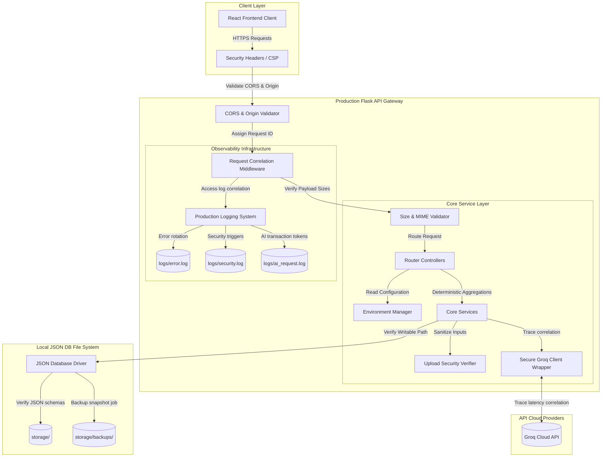

# Software Design Document: Production Infrastructure & Security (Phase 10A)

This document describes the architectural, configuration, logging, error handling, security hardening, and reliability design specifications for **Phase 10A: Production Infrastructure & Security** of the StudyAI application.

---

## 1. Overall Architecture

The production environment transitions the application into a secure, validated, and monitored system. The architecture implements strict boundaries between components and introduces unified request tracking and startup readiness validations.



---

## 2. Configuration Management

The backend transitions from a single configuration file into a class-based configuration system matching running environments.

### Class Hierarchy (`backend/config.py`)
```python
import os
import logging
from typing import Dict, Any

class BaseConfig:
    """Shared base configuration parameters."""
    SECRET_KEY = os.environ.get("FLASK_SECRET_KEY")
    GROQ_API_KEY = os.environ.get("GROQ_API_KEY")
    PORT = int(os.environ.get("PORT", 5000))
    FRONTEND_URL = os.environ.get("FRONTEND_URL", "http://localhost:5173")
    
    # Storage Paths
    BASE_DIR = os.path.dirname(os.path.abspath(__file__))
    STORAGE_DIR = os.path.join(BASE_DIR, "storage")
    UPLOADS_DIR = os.path.join(STORAGE_DIR, "materials", "raw")
    LOGS_DIR = os.path.join(BASE_DIR, "logs")
    
    # Limits
    MAX_CONTENT_LENGTH = 16 * 1024 * 1024  # 16 MB max payload size
    ALLOWED_EXTENSIONS = {"pdf", "docx", "txt"}
    
    # Feature Flags
    ENABLE_AI_INSIGHTS = True
    MAX_SUMMARY_VERSIONS_RETAINED = 5

class DevelopmentConfig(BaseConfig):
    DEBUG = True
    LOG_LEVEL = logging.DEBUG

class TestingConfig(BaseConfig):
    TESTING = True
    DEBUG = True
    LOG_LEVEL = logging.WARNING
    STORAGE_DIR = os.path.join(BaseConfig.BASE_DIR, "tests", "storage")

class ProductionConfig(BaseConfig):
    DEBUG = False
    LOG_LEVEL = logging.INFO
    
    # Force HTTPS cookie attributes
    SESSION_COOKIE_SECURE = True
    REMEMBER_COOKIE_SECURE = True
    SESSION_COOKIE_HTTPONLY = True
```

---

## 3. Environment & Startup Validation

Before spawning the Flask app, a startup verifier runs to prevent partial runtime crashes.

### Validation Script (`backend/utils/startup_validator.py`)
```
FUNCTION validate_production_readiness():
    # 1. Verify secrets and environment variables
    IF FLASK_SECRET_KEY is empty:
        RAISE ConfigurationError("Missing FLASK_SECRET_KEY environment variable.")
    IF GROQ_API_KEY is empty:
        RAISE ConfigurationError("Missing GROQ_API_KEY environment variable.")
        
    # 2. Verify storage directories exist and are writable
    FOR EACH path IN [STORAGE_DIR, UPLOADS_DIR, LOGS_DIR]:
        IF path does not exist:
            TRY: Create directory path
            EXCEPT: RAISE ConfigurationError("Cannot write to directory: " + path)
            
    # 3. Verify AI Prompt files exist on disk
    FOR EACH prompt IN ["base_system.txt", "summary_v1.txt", "flashcards_v1.txt", "quiz_v1.txt", "weak_topics_v1.txt", "study_plan_v1.txt", "analytics_insight_v1.txt"]:
        IF prompt does not exist in prompts folder:
            RAISE ConfigurationError("Missing required AI prompt template file: " + prompt)
            
    # 4. Initialize AI diagnostics connection
    Test connection to Groq API using a fast ping completion.
    IF connection fails:
        LOG WARNING "Startup AI connectivity check failed. Proceeding with caution."
```

---

## 4. Logging & Observability

Production logs are split into categories, formatted using JSON structures, and rotated automatically to prevent storage leaks.

### Formatting Structure
Each log entry contains a unified metadata context:
```json
{
  "timestamp": "2026-07-15T21:40:00.123Z",
  "log_level": "ERROR",
  "request_id": "req_82f1bc09",
  "correlation_id": "corr_9a87d2ef",
  "module": "services.ai.groq_service",
  "message": "Groq API call failed: Rate Limit Exceeded.",
  "execution_time_ms": 320,
  "exception": "RateLimitError"
}
```

### Log Categories
1.  **Access Logs (`logs/access.log`)**: Logs incoming requests, status codes, IP origins, and latency.
2.  **Error Logs (`logs/error.log`)**: Capture runtime failures (stack traces are logged internally but *never* sent in API responses).
3.  **AI Request Logs (`logs/ai_request.log`)**: Tracks LLM latencies, tokens consumed, and prompt versions.
4.  **Security Logs (`logs/security.log`)**: Tracks CORS blocks, invalid signatures, size limit overflows, and payload blocks.

### Log Rotation Policy
*   **Maximum File Size**: 10 MB per file.
*   **Retention Limit**: Keep last 14 rotated log archives on disk.

---

## 5. Unified Error Handling

The backend implements a catch-all exception handler converting exceptions into standard error payloads.

### JSON Error Schema
```json
{
  "error": {
    "code": "BAD_REQUEST",
    "message": "Please select a valid study material.",
    "request_id": "req_82f1bc09"
  }
}
```

---

## 6. Security Hardening

### Secure Headers (Flask-Talisman Integration)
Configure headers to enforce browser security controls:
*   **Content-Security-Policy (CSP)**: `default-src 'self'; script-src 'self' 'unsafe-inline'; style-src 'self' 'unsafe-inline';`
*   **X-Frame-Options**: `DENY` (prevents clickjacking).
*   **X-Content-Type-Options**: `nosniff` (forces MIME compliance).
*   **Referrer-Policy**: `strict-origin-when-cross-origin`.
*   **Strict-Transport-Security (HSTS)**: `max-age=31536000; includeSubDomains; preload` (forces HTTPS).

### CORS Whitelist Gate
*   Requests must match whitelisted origins inside `FRONTEND_URL`.
*   Origin values are matched explicitly rather than using wildcard `*` overrides.

---

## 7. Upload Security verifications

File uploads are verified across multiple parameters:
1.  **Filename Sanitization**: Strip path indicators (e.g., `../`) to prevent directory traversal.
2.  **Allowed Extensions & MIME Types**:
    *   `.pdf` $\rightarrow$ `application/pdf`
    *   `.docx` $\rightarrow$ `application/vnd.openxmlformats-officedocument.wordprocessingml.document`
    *   `.txt` $\rightarrow$ `text/plain`
3.  **Duplicate Detection**: Computes the MD5 checksum of the uploaded file and compares it to stored files to reject duplicate uploads.
4.  **Cleanup**: Automatically purges temporary files generated during processing.

---

## 8. AI Security Controls

*   **Prompt Length Cap**: Limits incoming user prompts and manual inputs to 15,000 characters.
*   **Model Schema Sanitization**: Wraps parsing logic in validator check blocks to verify JSON keys are formatted correctly.
*   **Timeouts & Retries**:
    *   **Timeout Limit**: 20 seconds.
    *   **Retry count**: max 3 attempts with exponential backoff.

---

## 9. Expanded Health Monitoring

The `/api/health` endpoint is expanded to return details about the deployment state:

```json
{
  "status": "healthy",
  "version": "1.0.0",
  "environment": "production",
  "uptime_seconds": 86400,
  "storage": {
    "whitelist": true,
    "available_bytes": 107374182400
  },
  "groq": {
    "connected": true,
    "latency_ms": 120
  }
}
```

---

## 10. Backup & Recovery Strategy

1.  **Snapshot Backups**: The storage layer runs automated tasks copying the `storage/` directory to `storage/backups/`.
2.  **History Retention Limit**: Retains the last 7 daily backup directories on disk, pruning older logs automatically.

---

## 11. Folder Structure Map

### New Folders
*   `backend/logs/`
*   `backend/utils/`

### New Files
*   `backend/utils/startup_validator.py` (Startup verifier)
*   `backend/utils/security_headers.py` (Talisman configuration)
*   `backend/utils/error_handlers.py` (JSON error filters)
*   `backend/utils/logger_factory.py` (Logger configuration)

### Modified Files
*   `backend/config.py` (Configuration class structure)
*   `backend/app.py` (App initialization, Talisman integration, validator launch)
*   `backend/routes/health.py` (Expanded health check parameters)
*   `frontend/src/components/ErrorBoundary.jsx` (Friendly error message displays)

---

## 12. Git Workflow

Commit iteratively during Phase 10A:

*   `feat(backend): implement class-based configuration environments`
*   `feat(backend): build startup validator verifying environment secrets`
*   `feat(backend): implement production logging and automatic rotation`
*   `feat(backend): configure secure headers and origin Whitelists`
*   `feat(backend): implement upload MIME checks and filename sanitization`
*   `test: write pytest unit tests checking missing configuration fallbacks`

---

## 13. Acceptance Criteria

1.  **Fail-Fast Startup Complete**: The backend immediately exits with a descriptive error code if `SECRET_KEY` or `GROQ_API_KEY` is missing.
2.  **Request Correlation Logged**: Every request is assigned a `Request-ID` header, which is printed in the access and error logs.
3.  **Security Headers Enforced**: Browser security audits confirm that CSP, HSTS, and Frame options are loaded.
4.  **Tests Pass**: Pytest testing suites run clean.
5.  **Compile Complete**: Frontend Vite packages compile cleanly.
