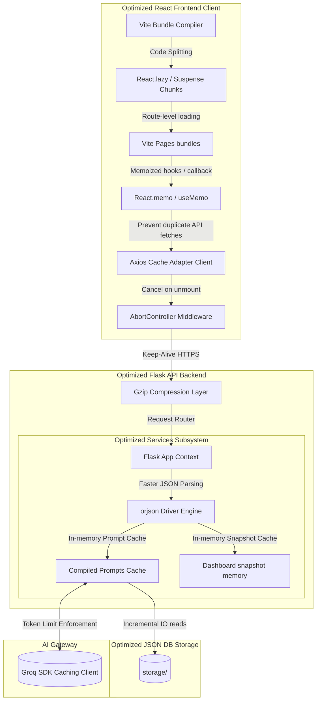
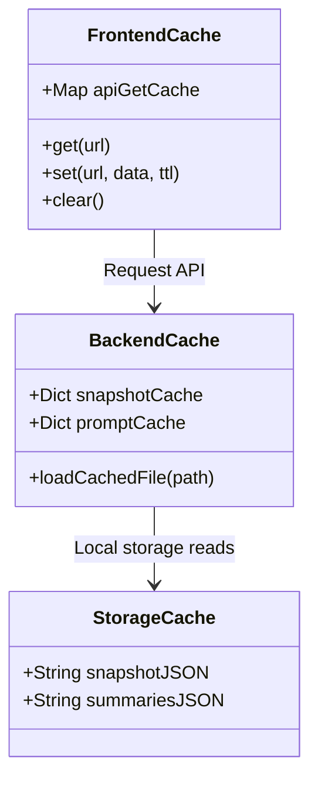

# Software Design Document: Performance Optimization (Phase 10B)

This document describes the architectural, configuration, caching, memoization, and loading design specifications for **Phase 10B: Performance Optimization** of the StudyAI application.

---

## 1. Overall Performance Architecture

The optimized architecture minimizes JS payload size, reduces browser main-thread blocking time, limits redundant API calls, and optimizes backend JSON parsing and local disk reads.



---

## 2. Performance & Lighthouse Goals

### Target KPIs
1.  **Bundle Size Reduction**: Reduce the initial route bundle size by at least **35–50%**.
2.  **Lazy Loading**: Enforce lazy loading for all secondary/nested page routes.
3.  **Vendor Splitting**: Split vendor libraries into distinct, cacheable chunks.
4.  **First Contentful Paint (FCP)**: $< 1.2\text{ seconds}$.
5.  **Largest Contentful Paint (LCP)**: $< 2.0\text{ seconds}$.
6.  **Cumulative Layout Shift (CLS)**: $< 0.1$.

### Target Lighthouse Ratings
*   **Performance**: $\ge 90$
*   **Accessibility**: $\ge 95$
*   **Best Practices**: $\ge 95$
*   **SEO**: $\ge 90$

---

## 3. Frontend Bundle Optimization

### Route-Level Lazy Loading
Instead of compiling all pages into a single chunk, pages are loaded on-demand:
```javascript
const Upload = React.lazy(() => import('./pages/Upload'));
const Summary = React.lazy(() => import('./pages/Summary'));
const Flashcards = React.lazy(() => import('./pages/Flashcards'));
```
The App routing tree is wrapped in `<React.Suspense fallback={<SkeletonLoader />} />` to handle loading transitions cleanly.

### Rollup Code-Splitting Chunking Strategy (`vite.config.js`)
Configures Rollup to split third-party vendors (like React, Recharts, and Lucide) into distinct cacheable packages:
```javascript
export default defineConfig({
  build: {
    rollupOptions: {
      output: {
        manualChunks(id) {
          if (id.includes('node_modules')) {
            if (id.includes('react')) return 'vendor-react';
            if (id.includes('recharts')) return 'vendor-recharts';
            if (id.includes('lucide')) return 'vendor-icons';
            return 'vendor-helpers';
          }
        }
      }
    }
  }
});
```

---

## 4. React Render & List Virtualization

### Memoization Hook Strategies
1.  **Memoize List Components**: Wrap interactive loops (like flashcards, quiz question lists, and weak topic lists) in `React.memo` to prevent parent updates from triggering child redraws.
2.  **Use `useMemo` & `useCallback`**:
    *   `useMemo`: Cache calculations for analytics aggregation, weak topics thresholds, and plan progress counts.
    *   `useCallback`: Wrap state mutation triggers passed to child elements to preserve referential equality.

### Conditional Virtualization Policy
To prevent introducing unnecessary complexity on small datasets, list virtualization is enforced conditionally based on dataset volumes:
*   **Flashcards**: Only virtualize list views if active deck card counts exceed **200 cards**.
*   **Quiz History**: Only virtualize evaluation reports lists if attempts exceed **200 attempts**.
*   **Activity Feed**: Only virtualize historical recent activity items if logged events exceed **500 events**.
For datasets below these thresholds, standard mapping is rendered to ensure lightweight component builds.

---

## 5. Asset & Icon Optimization

*   **Inline SVGs**: Replace heavy external resource image loads with inline SVG icons.
*   **Lazy Load Charts**: Wrap Recharts visualizations so they only initialize when scrolled into the browser viewport.
*   **System Fonts**: Prioritize system fonts (`system-ui`, `-apple-system`, `sans-serif`) over external Google Fonts to eliminate layout shift delays.

---

## 6. Client API Layer (Axios Caching)

*   **Caching Adapter**: Implement a client-side memory cache in the Axios wrapper. Multiple GET calls to `/api/v1/materials` or `/api/v1/plans` within a 15-second window resolve from memory.
*   **Abort Controllers**: Associate requests with `AbortController` limits; requests are canceled automatically when components unmount.
*   **Debouncing**: Apply 300ms input debouncing when editing study plans, manual summaries, or typing search values.

---

## 7. Backend Performance Enhancements

*   **Fast JSON Parsing**: Replace the default python `json` encoder/decoder with `orjson` to speed up reads on large JSON database registries.
*   **Compiled Prompt Caching**: Cache compiled text prompts in Flask memory to prevent repeated reads from disk.
*   **Incremental Storage Ingestion**: Use file descriptors and streams to read files instead of loading entire PDF/DOCX extractions into memory.

---

## 8. Storage & Database Optimization

*   **SNAP Caches**: Snapshot calculations for dashboards and analytics are saved on disk and loaded dynamically, eliminating file-scanning overhead.
*   **Lazy De-serialization**: Query index logs rather than parsing large content blocks when retrieving summary indices.

---

## 9. Upload & Parsing Optimizations

*   **Text Buffering**: Process DOCX and PDF text extractions in chunks rather than buffering entire books in memory, preventing thread memory overhead.
*   **Incremental Progress Pings**: Return socket status updates or short poll markers during large file ingestion jobs.

---

## 10. Unified Caching Strategy



---

## 11. Folder Structure Map

### New Files
*   `frontend/src/utils/axiosCache.js` (Axios memory caching adapter)
*   `backend/utils/orjson_compat.py` (Fast JSON parser bindings)

### Modified Files
*   `vite.config.js` (Manual Rollup code-splitting chunks)
*   `frontend/src/App.jsx` (React.lazy / Suspense routes)
*   `frontend/src/pages/AnalyticsDashboard.jsx` (Memoized callbacks, virtualization)
*   `backend/services/ai/prompt_manager.py` (Compiled prompts cache map)
*   `backend/services/storage_service.py` (Stream-based text extractors)

---

## 12. Git Workflow

Commit iteratively during Phase 10B:

*   `perf(frontend): configure Vite code-splitting and dynamic imports`
*   `perf(frontend): implement useMemo/useCallback memoizations on lists`
*   `perf(frontend): build Axios client-side cache and AbortControllers`
*   `perf(backend): replace python json bindings with fast orjson drivers`
*   `perf(backend): implement compiled AI prompts memory caching`
*   `test: write performance benchmark tests tracking render timings`

---

## 13. Acceptance Criteria

1.  **Initial Route Bundle Reduced**: Main entrypoint javascript bundle size decreases by **35–50%**.
2.  **Route Lazy-Loading Active**: Secondary router sub-modules load dynamic script tags only upon navigation.
3.  **Conditional Virtualization Operates**: Virtualized rendering handles list updates above designated volume targets (cards > 200, quizzes > 200, activities > 500).
4.  **Zero Feature Regression**: Practice tests, summaries, planner tasks, and card reviews operate normally.
5.  **Backend Response Times Optimized**: Response latency for `/api/v1/analytics/dashboard` drops below 100ms when cached.
