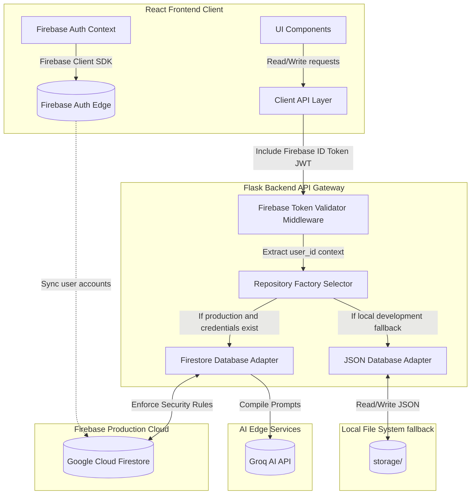
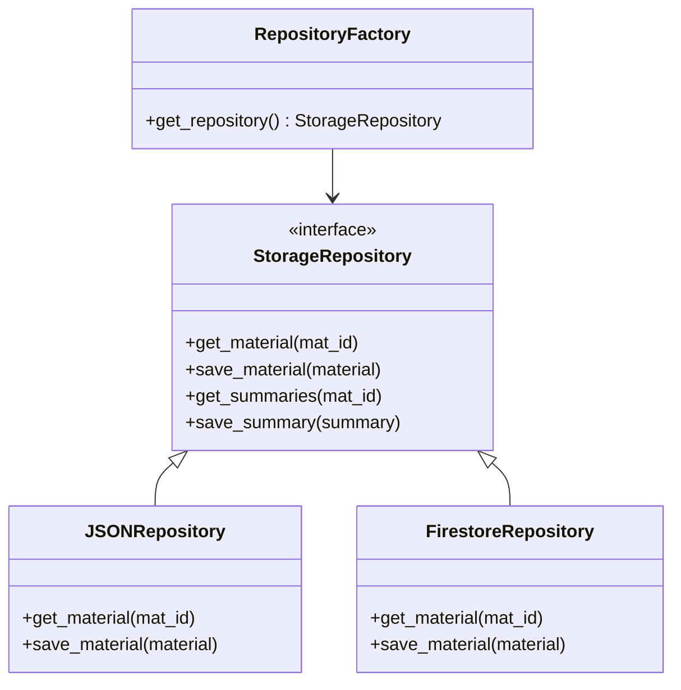
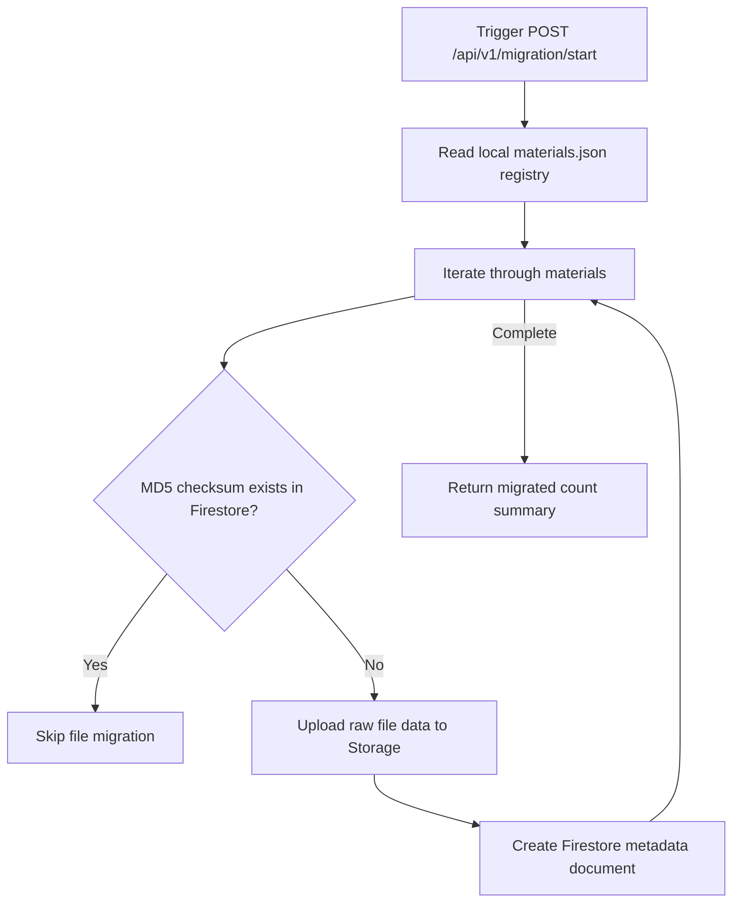

# Software Design Document: Firebase Production Integration (Phase 10C)

This document describes the architectural, security, repository abstraction, data schema, and fallback design specifications for **Phase 10C: Firebase Production Integration** of the StudyAI application.

---

## 1. Overall Cloud Architecture

The hybrid database architecture introduces Firebase as the primary production cloud provider while maintaining the local JSON database as a development fallback. The Repository Pattern isolates data retrieval mechanisms from core business logic.



---

## 2. Authentication Architecture

The application implements Firebase Authentication for user accounts:
*   **Email / Password Sign-In**: Uses standard email password authentication.
*   **Remember Me & Session Persistence**: Configures Firebase Auth to retain user sessions across browser restarts (`local` persistence).
*   **Protected Routes**: The frontend routes wrapper inspects the Firebase user profile object, redirecting unauthenticated users to `/login`.
*   **Email Verification & Password Reset**: Sends email verification links before activating dashboard access.
*   **Session Refresh**: The Axios client interceptor automatically refreshes expired tokens in the background before requests are dispatched.

---

## 3. Repository Abstraction Pattern

To switch between Firestore and local JSON files without modifying the application's service layer, we implement the Repository Pattern.



### Factory Selector Implementation Design
```python
import os
import firebase_admin
from config import get_config

class RepositoryFactory:
    _instance = None
    _use_firebase = False

    @classmethod
    def initialize(cls):
        cfg = get_config()
        # Initialize Firebase Admin SDK if credentials exist
        if cfg.FIREBASE_PROJECT_ID and cfg.FIREBASE_CREDENTIALS_PATH:
            try:
                if not firebase_admin._apps:
                    cred = firebase_admin.credentials.Certificate(cfg.FIREBASE_CREDENTIALS_PATH)
                    firebase_admin.initialize_app(cred)
                cls._use_firebase = True
            except Exception:
                cls._use_firebase = False
        else:
            cls._use_firebase = False

    @classmethod
    def get_repository(cls):
        if cls._use_firebase:
            from services.repositories.firestore_repository import FirestoreRepository
            return FirestoreRepository()
        else:
            from services.repositories.json_repository import JSONRepository
            return JSONRepository()
```

---

## 4. Firestore Schema Design

Firestore documents include metadata attributes to track ownership and enable filtering:
*   **`owner_id`**: The authenticated user's unique Firebase UID.
*   **`created_at`**: Server-generated timestamp.
*   **`version`**: Schema version number.

### Collections Structure

#### 1. `materials`
*   **Document ID**: `mat_{uuid}`
*   **Attributes**:
    ```json
    {
      "id": "mat_bd4f375a",
      "owner_id": "usr_abc123",
      "filename": "lecture_notes.pdf",
      "title": "Machine Learning Lecture Notes",
      "subject": "Computer Science",
      "file_type": "pdf",
      "size_bytes": 1048576,
      "md5_checksum": "cf8291a27ebef769da89",
      "created_at": "timestamp",
      "text_file_path": "storage/materials/texts/mat_bd4f375a.txt"
    }
    ```

#### 2. `summaries`
*   **Document ID**: `sum_{uuid}`
*   **Attributes**:
    ```json
    {
      "id": "sum_92b45f12",
      "material_id": "mat_bd4f375a",
      "owner_id": "usr_abc123",
      "active_version": 2,
      "updated_at": "timestamp"
    }
    ```

---

## 5. Security Rules

Enforce user data isolation at the database layer. Users can only read, write, or delete documents where they are the verified owner.

```javascript
rules_version = '2';
service cloud.firestore {
  match /databases/{database}/documents {
  
    // Helper to check user auth state
    function isAuthenticated() {
      return request.auth != null;
    }
    
    // Helper to verify resource ownership
    function isOwner(resource) {
      return isAuthenticated() && resource.data.owner_id == request.auth.uid;
    }

    // Match materials collection
    match /materials/{materialId} {
      allow create: if isAuthenticated() && request.resource.data.owner_id == request.auth.uid;
      allow read, update, delete: if isOwner(resource);
    }

    // Match summaries collection
    match /summaries/{summaryId} {
      allow create: if isAuthenticated() && request.resource.data.owner_id == request.auth.uid;
      allow read, update, delete: if isOwner(resource);
    }
  }
}
```

---

## 6. Offline Caching & Synchronization

### Frontend Client Cache Configuration
When using the web client, Firestore enables offline caching:
```javascript
import { initializeFirestore, persistentLocalCache, persistentMultipleTabManager } from 'firebase/firestore';

const db = initializeFirestore(app, {
  localCache: persistentLocalCache({
    tabManager: persistentMultipleTabManager()
  })
});
```

### Sync & Conflict Resolution
1.  **Reads**: If the network is offline, Firestore reads from the local cache.
2.  **Writes**: Writes are queued locally. When the connection is restored, the queue syncs with the server in the background.
3.  **Conflict Resolution**: Last-write-wins (LWW) is enforced by tracking the `updated_at` server timestamp.

---

## 7. JSON-to-Firestore Migration Strategy

A migration script scans the local JSON database directories, filters duplicate entries by checking MD5 checksums in Firestore, and uploads records to their corresponding Firestore collections.



*   **Duplicate Prevention**: Firestore queries are run against the `md5_checksum` field before uploading.
*   **Rollback Strategy**: If migration fails, the system reverts to the local JSON database configuration.

---

## 8. Folder Structure Map

### New Folders
*   `backend/services/repositories/` (Repository interface implementations)

### New Files
*   `backend/services/repositories/storage_repository.py` (Base Repository interface)
*   `backend/services/repositories/json_repository.py` (JSON implementation)
*   `backend/services/repositories/firestore_repository.py` (Firestore implementation)
*   `backend/services/repositories/repository_factory.py` (Factory selector class)
*   `backend/routes/migration.py` (JSON-to-Firestore migration script routes)
*   `frontend/src/services/firebase.js` (Web Firebase SDK configuration)

### Modified Files
*   `backend/app.py` (Initializes RepositoryFactory at startup)
*   `frontend/src/context/AuthContext.jsx` (Replaces JWT auth backend scaffold with Firebase authentication credentials)

---

## 9. Git Workflow

Commit iteratively during Phase 10C:

*   `feat(backend): implement StorageRepository interface and factory`
*   `feat(backend): build firestore repository metadata adapters`
*   `feat(backend): configure jwt verifier verifying firebase id tokens`
*   `feat(frontend): configure Firebase Web SDK and context adapters`
*   `feat(backend): build migration controller script for json fallback import`
*   `test: write integration test cases checking fallback mechanisms`

---

## 10. Acceptance Criteria

1.  **Repository Abstraction Complete**: Switching `FLASK_ENV` from `development` to `production` swaps database adapters without breaking business logic.
2.  **Firebase Auth Enforced**: JWT validation filters intercept backend routes and decode client Firebase ID tokens.
3.  **Data Isolation Active**: Firestore Security Rules block reads/writes if the document `owner_id` does not match the requester's authenticated UID.
4.  **Graceful Fallback**: The backend falls back to local JSON database storage if Firebase credentials are missing.
5.  **Clean Compile**: Both Vite builds and Pytest suites compile cleanly.
