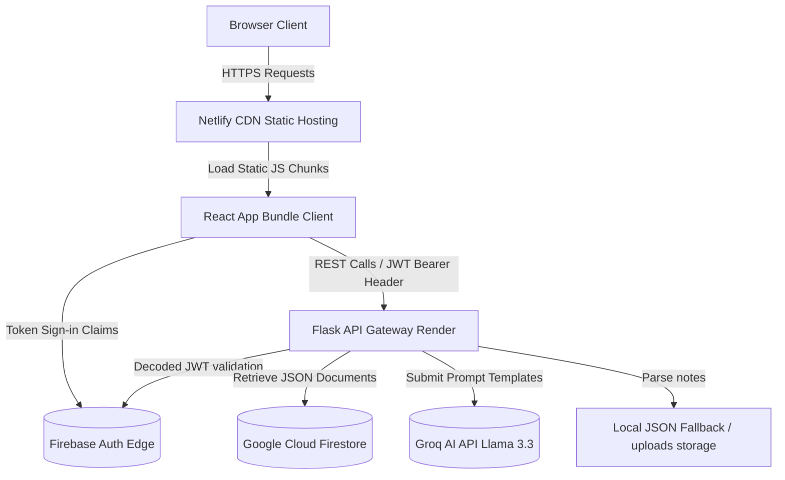

# Software Design Document: Deployment, Documentation & Final QA (Phase 10D)

This document describes the deployment, configuration, CI/CD pipelines, release notes, and documentation guides specifications for **Phase 10D: Deployment, Documentation & Final QA** of the StudyAI application.

---

## 1. Production Deployment Architecture

The production environment isolates client bundles from API backend runtimes. The architecture leverages secure cloud hosting with auto-scaling capabilities.



---

## 2. Production Environment Configuration (Secrets Placeholders)

Configuration parameters are loaded exclusively from system variables. Real secrets must never be committed to documentation.

### Backend Configurations (`backend/.env`)
```env
# Runtime Environment
FLASK_ENV=production
PORT=8080

# Secrets Security Hardening
SECRET_KEY=<your_secret_key>
FRONTEND_URL=<your_production_frontend_url>

# Groq AI Provider Settings
GROQ_API_KEY=<your_groq_api_key>
GROQ_TIMEOUT_SECONDS=20.0
GROQ_MAX_RETRIES=3

# Firebase Production DB Integrations
FIREBASE_PROJECT_ID=<your_project_id>
FIREBASE_CREDENTIALS_PATH=<path_to_credentials_json_file>
```

### Frontend Configurations (`frontend/.env`)
```env
# Frontend Base API Routing Gateway
VITE_API_BASE_URL=<your_production_backend_api_url>

# Firebase Web Client Settings
VITE_FIREBASE_API_KEY=<your_api_key>
VITE_FIREBASE_AUTH_DOMAIN=<your_auth_domain>
VITE_FIREBASE_PROJECT_ID=<your_project_id>
VITE_FIREBASE_STORAGE_BUCKET=<your_storage_bucket>
VITE_FIREBASE_MESSAGING_SENDER_ID=<your_messaging_sender_id>
VITE_FIREBASE_APP_ID=<your_app_id>
```

---

## 3. CI/CD Pipeline Strategy (GitHub Actions)

We implement a GitHub Actions pipeline split into verification and release stages. Build caches are enabled to speed up CI runs.

### GitHub Actions Workflow YAML Template (`.github/workflows/deploy.yml`)
```yaml
name: StudyAI CI/CD Release Pipeline

on:
  push:
    branches: [ main ]
    tags: [ 'v*' ]

jobs:
  verify:
    runs-on: ubuntu-latest
    steps:
      - name: Checkout Code
        uses: actions/checkout@v3

      - name: Setup Python
        uses: actions/setup-python@v4
        with:
          python-version: '3.12'
          cache: 'pip' # Speeds up Python package installation

      - name: Install Backend Dependencies
        run: |
          cd backend
          python -m pip install --upgrade pip
          pip install -r requirements.txt

      - name: Run Backend Tests
        run: |
          cd backend
          pytest tests/ -v

      - name: Setup Node
        uses: actions/setup-node@v3
        with:
          node-version: '20'
          cache: 'npm' # Speeds up Node package installation
          cache-dependency-path: 'frontend/package-lock.json'

      - name: Install Frontend Dependencies
        run: |
          cd frontend
          npm install

      - name: Build Frontend
        run: |
          cd frontend
          npm run build
```

---

## 4. Final Testing & QA Strategy

The final QA phase enforces multiple testing layers:
1.  **Unit Tests**: Pytest suites checking mathematical scopes, metadata indices calculations, and configuration boundaries.
2.  **API Verification**: Automated checks verify HTTP header trace attributes, payload constraints, and JSON response compliance.
3.  **End-to-End User Journey Tests**: Verifies a complete study session:
    `Upload note text -> Generate Summary -> Build Flashcard Deck -> Attempt Quiz -> Trigger Diagnostics -> Create Schedule -> View Analytics`.
4.  **CORS & Origin Checks**: Verifies request blocks when origin values mismatch whitelisted boundaries.

---

## 5. Deployment Validation & Release Checklists

### Final Release Quality Gate
Before tagging version `v1.0.0`, all items on the release checklist must pass:
*   [ ] **All Tests Pass**: Pytest execution verifies 100% success on all 37 test cases.
*   [ ] **Frontend Builds**: Vite compilation completes without warnings or circular dependency blocks.
*   [ ] **Backend Starts**: App starts on Render without configuration/validation crashes.
*   [ ] **Firebase Configured**: Admin SDK connects and verifies test ID tokens.
*   [ ] **Groq Configured**: LLM latency pings return valid completions.
*   [ ] **HTTPS Enforced**: Talisman rules and HSTS are active in production config profiles.
*   [ ] **README Verified**: Setup instructions are confirmed copy-paste deployable.
*   [ ] **Installation Guide Tested**: Workspace imports check out on fresh sandbox instances.
*   [ ] **API Documentation Complete**: Path listings are documented with sample JSON shapes.
*   [ ] **No Critical Bugs**: Review issues lists and clear open tickets.
*   [ ] **Version Tagged**: Stable code tagged `v1.0.0`.

---

## 6. Documentation Requirements

The following sections must exist in the root `README.md` to ensure portfolio-quality presentation:
*   **Project Overview**: Abstract and description of the tool.
*   **Architecture**: High-level system structure, database abstractions, and deployment mapping diagrams.
*   **Tech Stack**: Detailed list of technologies (Vite, Flask, Firestore, Groq API, Recharts, Talisman).
*   **Features**: Summary of learning modules (Summaries, Decks, Quizzes, Scorer, Planners, Analytics).
*   **Screenshots**: UI screenshots showing dark-mode designs.
*   **Installation**: Clear steps for setting up local development instances.
*   **Environment Variables**: Setup reference tables explaining configuration parameters.
*   **Running Locally**: Shell command sequences to launch dev servers.
*   **Running Tests**: Pytest execution guide.
*   **Deployment**: Production guidelines for Netlify and Render.
*   **Folder Structure**: Directory structures map.
*   **API Documentation**: Endpoint reference tables.
*   **License**: Project license terms (MIT/Apache).
*   **Contributors**: Authors attribution page.

---

## 7. Version Release Notes (StudyAI v1.0)

StudyAI v1.0 is a portfolio-ready full-stack academic tool powered by Groq Llama 3.3.

### Features
*   Multiformat text ingestors (PDF, DOCX, TXT, and manual inputs).
*   Dynamic summary parser utilizing sliding-window text chunking.
*   Interactive flashcard decks with spaced repetition metrics (SM-2 parameters).
*   Diagnostic weak topic scorer with automated study plan scheduling.
*   Lighthouse-optimized dark mode dashboard.

### Known Limitations
*   Firestore caching does not support offline uploads.
*   Groq API connections require network connectivity.

---

## 8. Folder Structure Map

### New Folders
*   `.github/workflows/` (GitHub Actions directory)
*   `docs/` (Unified user configuration guides)

### New Files
*   `.github/workflows/deploy.yml` (CI/CD release runner configuration)
*   `docs/INSTALLATION.md` (System installation instructions)
*   `docs/DEVELOPER_GUIDE.md` (Developer guidelines)
*   `docs/TROUBLESHOOTING.md` (Troubleshooting guide)

### Modified Files
*   `README.md` (Updated with architectural maps and setup commands)

---

## 9. Final Acceptance Criteria

StudyAI is considered production-ready when:
1.  **Tests Pass**: All 37 pytest backend verification tests run clean.
2.  **Frontend Compiles**: Vite production packages compile with zero compilation errors.
3.  **Deployments Validate**: Gateway health checks confirm storage and AI availability.
4.  **Installer Validated**: The application can be installed and run locally using only the instructions in `README.md`.
5.  **Documentation Complete**: Guides for installation, schemas, and credentials setup exist in the `docs/` folder.
