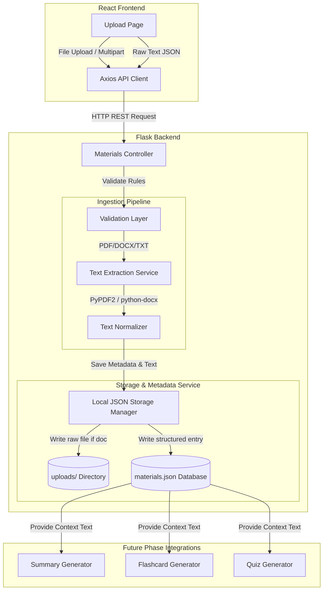

# Software Design Document: Study Material Upload System (Phase 2) — Revision 2

This document describes the updated architectural, security, API, and frontend/backend implementations for **Phase 2: Study Material Upload System** of the StudyAI application.

---

## 1. Overall Architecture

The Upload System functions as the core data ingestion pipeline. It allows students to supply context materials that will feed future downstream AI sub-systems (e.g., summary generators, flashcard/quiz generators).



---

## 2. Frontend Architecture

The frontend implementation lives under `frontend/src/` and introduces structured state management and interaction nodes.

### Component Structure
* **`pages/Upload.jsx`**: Main controller view displaying the upload interface.
* **`components/upload/DragDropZone.jsx`**: File drag-and-drop landing target. Supports native HTML5 file drop APIs.
* **`components/upload/ManualTextInput.jsx`**: Form textarea for manual typing/pasting of notes with subject selections.
* **`components/upload/UploadProgress.jsx`**: Component that tracks and visualizes upload progress percentage.
* **`components/upload/MaterialList.jsx`**: Displays uploaded files/texts with options to view or delete.
* **`components/ui/Skeleton.jsx`**: Loading state placeholders.

### Component Breakdown & Folder Map
```
src/
├── components/
│   └── upload/
│       ├── DragDropZone.jsx
│       ├── ManualTextInput.jsx
│       ├── UploadProgress.jsx
│       └── MaterialList.jsx
├── pages/
│   └── Upload.jsx
```

### State Management & Form Flows
* **`Upload.jsx` (Page Level)**:
  * `materials`: Array of metadata items loaded from `GET /api/v1/materials`.
  * `isUploading`: Boolean indicating whether a file upload is in progress.
  * `uploadProgress`: Integer (0 to 100) monitoring current upload progress.
  * `activeTab`: String (`'file'` or `'text'`) switching upload modes.
  * `isProcessing`: Boolean tracking server-side validation/parsing.
  * `selectedSubject`: String mapping category for the uploaded material.
* **Duplicate Detection Handler**:
  * If a file upload returns a notification that it was previously uploaded (via md5 matching), the UI prompts: *"This file appears to have been uploaded before. Do you want to upload it anyway?"* containing confirmation buttons to bypass the warning.

### UX Specifications & Constraints
* **Max File Size**: 16 MB.
* **Allowed Extensions**: `.pdf`, `.docx`, `.txt`.
* **Drag & Drop**: Integrates drag-over styling (glassmorphism highlight & pulse animation).
* **Accessibility**: Fully keyboard-navigable (`Tab` indexing for the file picker), screen-reader friendly descriptive tags, and appropriate focus indicators.
* **Error Handling**: Real-time validation error alerts using `react-hot-toast` before dispatching to the network.

---

## 3. Backend Architecture

The backend implements a decoupled Service-Layer pattern.

```
backend/
├── routes/
│   └── materials.py       # REST Controllers
├── services/
│   ├── storage_service.py # Local JSON storage implementation
│   └── extractor.py       # Text extraction engines (PyPDF2, python-docx)
├── utils/
│   └── validators.py      # File & Text format validators
```

### Decoupled Sub-layers
1. **Routing Layer (`routes/materials.py`)**: Defines URL rules, parses requests, and calls appropriate controllers.
2. **Validation Layer (`utils/validators.py`)**: Sanitizes names, checks mime-types, file sizes, and empty buffers.
3. **Extraction Layer (`services/extractor.py`)**: Extracts raw text blocks based on parsed mime-types and calculates stats (pages, words, characters).
4. **Storage Layer (`services/storage_service.py`)**: Performs thread-safe read/write actions on the local JSON file database.
5. **Logging & Error Catching**: Writes system actions, successes, and warnings to `logs/app.log`. Integrates with the global error handler.

---

## 4. API Design

All endpoints follow versioning practices under `/api/v1`. Authentication headers are **NOT** required at this stage.

### 1. POST `/api/v1/materials/upload`
* **Purpose**: Upload a PDF, DOCX, or TXT file and extract its content.
* **Request Format**: `multipart/form-data`
  * Parameters:
    * `file`: File binary.
    * `subject`: Subject category string (e.g. "Biology", "Computer Science"). Default is "General".
    * `force`: Optional boolean parameter. If `true`, bypasses MD5 duplicate checks.
* **Successful Response** (`201 Created`):
  ```json
  {
    "id": "mat_89410d9f",
    "title": "biology_notes",
    "subject": "Biology",
    "filename": "biology_notes.pdf",
    "file_type": "pdf",
    "size_bytes": 1048576,
    "page_count": 12,
    "word_count": 3410,
    "character_count": 21040,
    "summary_generated": false,
    "flashcards_generated": false,
    "quiz_generated": false,
    "created_at": "2026-07-15T15:10:00Z"
  }
  ```
* **Validation Rules**:
  * File parameter must be present.
  * Extension must match `.pdf`, `.docx`, or `.txt`.
  * Maximum size must not exceed 16,777,216 bytes (16MB).
* **Duplicate Detection Warning** (`200 OK` when `force=false` and duplicate md5 checksum matches):
  ```json
  {
    "warning": "duplicate_detected",
    "message": "This file appears to have been uploaded before.",
    "existing_material_id": "mat_89410d9f"
  }
  ```
* **Error States**:
  * `400 Bad Request`: `{ "error": "No file uploaded or file empty" }`
  * `415 Unsupported Media Type`: `{ "error": "Invalid file type. Only PDF, DOCX, TXT allowed." }`
  * `413 Payload Too Large`: `{ "error": "File size exceeds 16MB limit" }`

### 2. POST `/api/v1/materials/text`
* **Purpose**: Create a material source from raw copy-pasted text.
* **Request Format**: `application/json`
  * Body Parameters:
    ```json
    {
      "title": "Calculus Notes Part 1",
      "subject": "Mathematics",
      "text": "Raw pasted text content goes here..."
    }
    ```
* **Successful Response** (`201 Created`):
  ```json
  {
    "id": "mat_4fa89bc2",
    "title": "Calculus Notes Part 1",
    "subject": "Mathematics",
    "filename": "text_paste.txt",
    "file_type": "text_paste",
    "size_bytes": 35,
    "page_count": 1,
    "word_count": 7,
    "character_count": 35,
    "summary_generated": false,
    "flashcards_generated": false,
    "quiz_generated": false,
    "created_at": "2026-07-15T15:12:00Z"
  }
  ```
* **Validation Rules**:
  * `title` and `text` properties are mandatory.
  * Title and text must not be empty or whitespace-only.
  * Text length must be under 1,000,000 characters.
* **Error States**:
  * `400 Bad Request`: `{ "error": "Title and text content are required" }`

### 3. GET `/api/v1/materials`
* **Purpose**: List metadata of all uploaded materials.
* **Request Format**: None.
* **Successful Response** (`200 OK`):
  ```json
  [
    {
      "id": "mat_89410d9f",
      "title": "biology_notes",
      "subject": "Biology",
      "filename": "biology_notes.pdf",
      "file_type": "pdf",
      "size_bytes": 1048576,
      "page_count": 12,
      "word_count": 3410,
      "character_count": 21040,
      "summary_generated": false,
      "flashcards_generated": false,
      "quiz_generated": false,
      "created_at": "2026-07-15T15:10:00Z"
    }
  ]
  ```

### 4. GET `/api/v1/materials/{id}`
* **Purpose**: Fetch details of a specific material (including full extracted text).
* **Request Format**: URL Path parameter `id`.
* **Successful Response** (`200 OK`):
  ```json
  {
    "id": "mat_89410d9f",
    "title": "biology_notes",
    "subject": "Biology",
    "filename": "biology_notes.pdf",
    "file_type": "pdf",
    "size_bytes": 1048576,
    "page_count": 12,
    "word_count": 3410,
    "character_count": 21040,
    "extracted_text": "Extracted text content starts here...",
    "summary_generated": false,
    "flashcards_generated": false,
    "quiz_generated": false,
    "created_at": "2026-07-15T15:10:00Z"
  }
  ```
* **Error States**:
  * `404 Not Found`: `{ "error": "Material resource not found" }`

### 5. DELETE `/api/v1/materials/{id}`
* **Purpose**: Remove study material metadata, text, and stored binaries.
* **Request Format**: URL Path parameter `id`.
* **Successful Response** (`200 OK`):
  ```json
  {
    "message": "Material deleted successfully",
    "id": "mat_89410d9f"
  }
  ```
* **Error States**:
  * `404 Not Found`: `{ "error": "Material resource not found" }`

---

## 5. File Validation Layer

1. **Extension Checks**: Compares against an allowed whitelist: `ALLOWED_EXTENSIONS = {'pdf', 'docx', 'txt'}`.
2. **File Size Check**: Validates `Content-Length` headers and file read streams up to 16MB.
3. **Empty File Interceptor**: Verifies that the file size is greater than 0 bytes.
4. **Corrupted File Interceptor**: Attempts basic parsing of structural headers before saving (e.g., checks PDF starting magic bytes `%PDF`).
5. **Duplicate Upload Checker**: Calculates the MD5 checksum of the incoming file buffer. If it matches a record:
   * Returns a custom warning response to allow client override.
   * If `force=true` is sent by the client, it bypasses rejection and saves as a new unique file.

---

## 6. Text Extraction Architecture

The system utilizes Python packages to convert binaries into plaintext blocks.

### Libraries & Strategies
* **PDF Parser**: `PyPDF2`
  * Reads the PDF stream.
  * Loops through all pages extracting text via `page.extract_text()`.
  * Extracts page count directly from PDF stream.
* **Word Parser**: `python-docx`
  * Reads DOCX paragraphs and tables.
  * Joins paragraph text runs using newline delimiters.
  * Approximates page count statistics by text density metrics (1 page ≈ 500 words).
* **Text Parser**: Native Python text streaming.
  * Decodes text streams using `utf-8` with fallback to `latin-1` to prevent encoding exceptions.
  * Word count is extracted via token counts (`len(text.split())`).

### Extraction Error Handling
* Any processing crash throws a custom `TextExtractionError`.
* Partial extractions return what could be parsed, appending a warning indicator to the metadata log.

---

## 7. Local Storage Engine (JSON Fallback)

To remain highly portable and easy to run without database configuration, the storage layer relies on local disk read/writes.

### Directory Structure
```
backend/
├── storage/
│   └── data/
│       ├── materials.json     # Metadata index database
│       └── texts/             # Separated full-text files to keep registry small
│           ├── mat_89410d9f.txt
│           └── mat_4fa89bc2.txt
```

### JSON Registry Schema (`materials.json`)
```json
{
  "materials": [
    {
      "id": "mat_89410d9f",
      "title": "biology_notes",
      "subject": "Biology",
      "filename": "biology_notes.pdf",
      "file_type": "pdf",
      "size_bytes": 1048576,
      "md5_checksum": "9e107d9d372bb6826bd81d3542a419d6",
      "page_count": 12,
      "word_count": 3410,
      "character_count": 21040,
      "summary_generated": false,
      "flashcards_generated": false,
      "quiz_generated": false,
      "created_at": "2026-07-15T15:10:00Z",
      "updated_at": "2026-07-15T15:10:00Z",
      "text_file_path": "storage/data/texts/mat_89410d9f.txt",
      "raw_file_path": "uploads/mat_89410d9f.pdf"
    }
  ]
}
```

### Unique ID Generation
IDs are generated via Python's `uuid` library using standard prefixes: `mat_` followed by the first 8 characters of `uuid.uuid4().hex`.

---

## 8. Dashboard Integration

The dashboard metrics display dynamic counts based on the uploaded data registry.

* **Materials Counter**: Computes the sum of all elements in the `materials` array returned by `GET /api/v1/materials`.
* **Recent Uploads Widget**: Displays a list of the 3 most recently created items, sorted by `created_at`.
* **Actions**: Includes a trash icon to delete materials directly, and a link to view their content.

---

## 9. UI/UX Specifications

The design features custom Tailwind styling for a premium feel.

* **Vibrant Active Area**: Highlights drag zones with a dashed primary border and animated opacity shifts.
* **Upload Progress Meter**: Interactive progress indicators displaying percentages.
* **Status States**:
  * *Loading skeleton*: Simulates text blocks during API requests.
  * *Empty state illustration*: Suggests uploads when the material count is zero.

---

## 10. Security Controls

* **Filename Sanitization**: Utilizes `werkzeug.utils.secure_filename` to strip unsafe character groupings and paths.
* **Path Traversal Shield**: Resolves target directories to absolute paths, verifying they remain within designated boundaries.
* **Storage Isolation**: Saves raw files under random UUID filenames inside the isolated `uploads/` directory, preventing executable scripting risks.

---

## 11. Testing Strategy

### 1. Backend (Pytest)
* `test_upload_valid_file`: Verifies successful PDF/DOCX uploads and stats generation.
* `test_upload_file_too_large`: Tests rejection of files larger than 16MB.
* `test_upload_invalid_type`: Tests 415 error codes for unsupported formats.
* `test_duplicate_upload_warning`: Tests warning response on duplicate checksum checks.

### 2. Frontend (Vitest + React Testing Library)
* Simulates dragging and dropping valid/invalid files.
* Asserts validation boundaries (toast warnings for file sizes and formats).

### 3. Edge Cases
* Extremely long files.
* Password-protected/encrypted PDF uploads.
* Copy-pasting massive strings of text.

---

## 12. Git Workflow

Commit early and incrementally:

* `feat(backend): implement file validation and text extraction services`
* `feat(backend): create REST API routes for material storage`
* `feat(frontend): build drag & drop component and paste input tabs`
* `feat(frontend): connect API client and progress states`
* `test: verify upload API routes and extraction workflows`

---

## 13. Deliverables

### Files to be Created
* `backend/routes/materials.py`
* `backend/services/storage_service.py`
* `backend/services/extractor.py`
* `backend/utils/validators.py`
* `backend/tests/test_materials.py`
* `frontend/src/components/upload/DragDropZone.jsx`
* `frontend/src/components/upload/ManualTextInput.jsx`
* `frontend/src/components/upload/UploadProgress.jsx`
* `frontend/src/components/upload/MaterialList.jsx`
* `frontend/src/components/ui/Skeleton.jsx`

### Files to be Modified
* `backend/routes/__init__.py` (Register materials blueprint)
* `backend/app.py` (Add storage subdirectories check)
* `frontend/src/pages/Upload.jsx` (Integrate components & API calls)
* `frontend/src/pages/Dashboard.jsx` (Display dynamic stats & list)
* `frontend/src/constants/index.js` (Add upload & get routes constants)

---

## 14. Acceptance Criteria

1. **Successful Parsing**: Uploading valid PDF, DOCX, or TXT files returns a `201 Created` status code and extracts the raw text with valid stats.
2. **Validation Rules Enforced**: Attempts to upload files over 16MB or invalid formats fail with appropriate error messages.
3. **Data Persistence**: Pasted text or uploaded files persist in `materials.json` and are viewable in the UI.
4. **Dashboard Integration**: The Dashboard counts update dynamically when materials are added or deleted.
5. **Robust Security**: File paths are sanitized, preventing traversal and script execution exploits.
