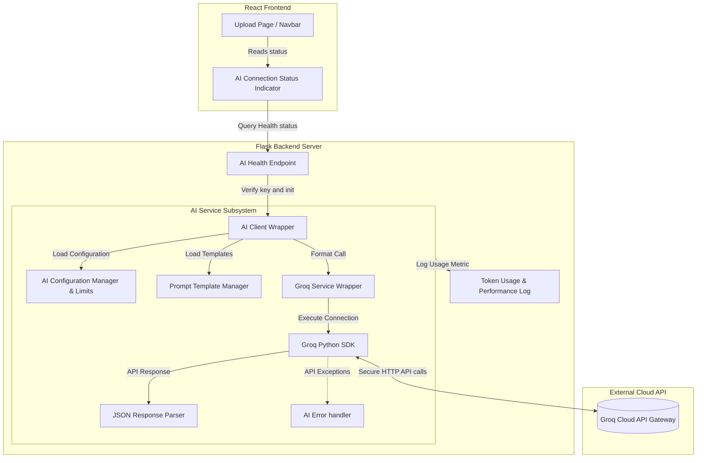

# Software Design Document: Groq AI Integration & Prompt Engineering (Phase 3) — Revision 2

This document describes the updated architectural, security, API, service layer, and prompt management configurations for **Phase 3: Groq AI Integration & Prompt Engineering** of the StudyAI application.

---

## 1. Overall AI Architecture

Phase 3 builds the orchestration engine and infrastructure for AI integration. It acts as an isolated server-side layer that maps study materials stored in local JSON format to LLM completion cycles without exposing keys or credentials.



---

## 2. Groq Integration

### Package Dependency
The backend will install the official python wrapper for Groq: `groq>=0.4.0`.

### Environment Configuration
The backend `.env` configuration file defines the secrets and endpoints:
```env
GROQ_API_KEY=gsk_your_live_production_key_here
GROQ_TIMEOUT_SECONDS=30.0
GROQ_MAX_RETRIES=3
```
*   **Key Protection**: Under no circumstances is the `GROQ_API_KEY` sent to the client browser. All transactions are proxied through Flask routes.

### Ingestion Usage Limits Configuration
Centralized configuration controls token usage and rate ceilings:
```python
MAX_PROMPT_LENGTH = 50000        # Max length in characters of text sent to prompt
MAX_OUTPUT_TOKENS = 4096         # Max return token parameter for Llama
MAX_REQUESTS_PER_MINUTE = 20     # Soft rate limit ceiling for safety
```

### Handling and Resilience
*   **Timeout Rules**: Requests are aborted if the connection, handshake, or response stream exceeds the defined timeout parameter (default: 30 seconds) throwing a custom `AITimeoutException`.
*   **Retry Protocol**: Uses exponential backoff for temporary 5xx errors or network loss. Standard retry limits are set to 3.
*   **Rate Limits Strategy**: Intercepts `429 Too Many Requests` responses. Reads the response headers (`x-ratelimit-reset`, `retry-after`) and raises a structured `AIRateLimitException` specifying the required cool-down period.

---

## 3. AI Service Layer

A dedicated service subdirectory is introduced at `backend/services/ai/`.

### Folder Map
```
backend/services/ai/
├── __init__.py
├── ai_client.py         # Entry interface wrapper orchestrating AI actions
├── groq_service.py      # SDK connector handling handshakes and raw calls
├── prompt_manager.py    # central file template registry
├── response_parser.py   # Cleans and parses LLM outputs (e.g. JSON strings)
└── ai_exceptions.py     # Hierarchical exceptions (Timeout, RateLimit, KeyInvalid)
```

### Module Responsibilities
*   **`ai_client.py`**: The singleton client used by endpoints. It coordinates prompt retrieval, model selection, parameters binding, execution, logging, and response parsing.
*   **`groq_service.py`**: Interacts with the `Groq` client instance. Handles network handshakes, parameter passing (temperature, max tokens), and catches HTTP exceptions.
*   **`prompt_manager.py`**: Handles locating, caching, and interpolating prompt files.
*   **`response_parser.py`**: Validates JSON formatting from outputs, strips markdown delimiters (e.g., ` ```json ` tags), and structures the data dictionary.
*   **`ai_exceptions.py`**: Standardizes error handling.

---

## 4. Prompt Engineering Architecture

To keep prompt templates maintainable and decoupled from Python scripts, they are stored in external plain text files. 

Only infrastructure-specific prompts are created during Phase 3 to keep Git history clean. Downstream prompts (summaries, quizzes, planners) will be added during their respective development phases.

### Directory Structure
```
backend/services/ai/prompts/
├── base_system.txt     # System instruction scaffolding
└── test_ping.txt       # Static text template used strictly for connection testing
```

### Registry & Maintenance
*   **Template Formatting**: Templates use standard brace notation `{{ context_variable }}` for parameter mapping.
*   **Prompt Manager Responsibility**: Loads raw templates from disk, verifies parameters, and interpolates data blocks before sending requests.
*   **Versioning Protocol**: Templates use version suffixes (e.g., `_v1.txt`).

---

## 5. AI Configuration & Model Registry

To support seamless transitions between models later, model selection is managed via a centralized Model Registry:

```python
MODELS = {
    "default": "llama-3.3-70b-versatile",
    "fast": "llama-3.1-8b-instant"
}
```

### Inference Parameters
*   **Temperature**:
    *   *Default*: `0.2` (deterministic, fact-driven outputs).
*   **Max Tokens**: Default is capped at `MAX_OUTPUT_TOKENS` (4096 tokens).
*   **Top P**: `0.9` (limits cumulative probability boundaries to relevant tokens).
*   **Stop Sequences**: Supported but not default; configured per model mapping.

---

## 6. AI APIs

Infrastructure endpoints are exposed under `/api/v1/ai`.

### 1. GET `/api/v1/ai/health`
*   **Purpose**: Test backend key availability and SDK initialization without calling the LLM (preventing token usage spikes).
*   **Request Format**: None.
*   **Successful Response** (`200 OK`):
    ```json
    {
      "status": "healthy",
      "api_key_configured": true,
      "client_initialized": true,
      "default_model": "llama-3.3-70b-versatile",
      "timestamp": "2026-07-15T15:40:00Z"
    }
    ```
*   **Error States**:
    *   `500 Internal Server Error`: `{ "error": "Groq client failed to initialize. Check API key configurations." }`

### 2. POST `/api/v1/ai/test`
*   **Purpose**: Perform a live dry-run call to Groq using `test_ping.txt` to verify connectivity.
*   **Request Format**: `application/json`
    *   Body Parameters:
        ```json
        {
          "test_text": "Verify this text parses successfully"
        }
        ```
*   **Response** (`200 OK`):
    ```json
    {
      "success": true,
      "raw_response": "Ping Response: Verify this text parses successfully",
      "tokens_used": 28,
      "latency_ms": 190
    }
    ```
*   **Validation Rules**:
    *   `test_text` must not exceed `MAX_PROMPT_LENGTH` limits.
*   **Error States**:
    *   `503 Service Unavailable`: `{ "error": "Groq API is unreachable or rate limited." }`
    *   `401 Unauthorized`: `{ "error": "Groq API Key is invalid or expired." }`

---

## 7. Frontend Integration

Diagnostics UIs and Settings layouts are postponed to keep focus on scaffolding. A simple health indicator is placed on the Dashboard.

### Component Details
*   **Status Indicator (`components/ai/AIStatusIndicator.jsx`)**: Renders a clean status indicator directly next to the Health Check banner on the Dashboard.
    *   `Green Circle Icon`: AI Service Configured.
    *   `Red Circle Icon`: AI Service Disabled / Config Error.
*   Loads state via Axios call to `GET /api/v1/ai/health` on mount.

---

## 8. Security Controls

*   **Server Isolation**: The React client cannot request direct AI interactions. All requests must route through Flask.
*   **Input Sanitization**: Filters input strings for systemic tags to prevent script injection.
*   **Prompt Injection Shield**: Wraps user-supplied content inside strict separator boundaries within system prompt templates:
    ```
    [START OF STUDENT MATERIAL]
    {{ user_material }}
    [END OF STUDENT MATERIAL]
    ```
*   **Payload Capping**: Sets a limit on prompt size to `MAX_PROMPT_LENGTH` (50,000 characters) to prevent token exhaustion exploits.

---

## 9. Logging Strategy

All AI completions generate metrics logged under `backend/logs/ai_completions.log`.

### Metadata Tracks
*   **Request Unique ID**: Tracks correlation values throughout the pipeline.
*   **Latency Metrics**: Records latency in milliseconds (ms).
*   **Token Metrics**: Tracks `prompt_tokens`, `completion_tokens`, and `total_tokens`.
*   **Cost Calculations**: Logs estimated cost values based on model prices per 1M tokens.

---

## 10. Testing Strategy

### 1. Mock Implementations
Tests utilize Pytest fixtures to intercept `groq.Client` calls and return mock objects containing expected completion response properties.

### 2. Pytest Cases
*   `test_ai_health_check_healthy`: Verifies healthy configuration returns.
*   `test_ai_health_check_unconfigured`: Verifies response when API Key environment variables are missing.
*   `test_ai_test_route_success`: Simulates a mock test ping call returning success.
*   `test_ai_test_route_rate_limit`: Returns `503 Service Unavailable` with `retry-after` header fields.
*   `test_ai_timeout_handling`: Simulates slow connections, throwing exceptions.

---

## 11. Folder Structure Map

### New Folders
*   `backend/services/ai/`
*   `backend/services/ai/prompts/`
*   `frontend/src/components/ai/`

### New Files
*   `backend/services/ai/__init__.py`
*   `backend/services/ai/ai_client.py`
*   `backend/services/ai/groq_service.py`
*   `backend/services/ai/prompt_manager.py`
*   `backend/services/ai/response_parser.py`
*   `backend/services/ai/ai_exceptions.py`
*   `backend/services/ai/prompts/base_system.txt`
*   `backend/services/ai/prompts/test_ping.txt`
*   `backend/routes/ai.py`
*   `backend/tests/test_ai.py`
*   `frontend/src/components/ai/AIStatusIndicator.jsx`

---

## 12. Git Workflow

Commit iteratively during Phase 3 setup:

*   `chore(backend): install groq SDK and update requirements.txt`
*   `feat(backend): implement base AI service exceptions and centralized registry config`
*   `feat(backend): build prompt manager with base system and test ping templates`
*   `feat(backend): create Flask AI routes and config health checks`
*   `feat(frontend): build AI status indicator component on dashboard`
*   `test: create mock tests verifying AI config validations and timeouts`

---

## 13. Deliverables

### Files Created
*   `backend/services/ai/__init__.py`
*   `backend/services/ai/ai_client.py`
*   `backend/services/ai/groq_service.py`
*   `backend/services/ai/prompt_manager.py`
*   `backend/services/ai/response_parser.py`
*   `backend/services/ai/ai_exceptions.py`
*   `backend/services/ai/prompts/base_system.txt`
*   `backend/services/ai/prompts/test_ping.txt`
*   `backend/routes/ai.py`
*   `backend/tests/test_ai.py`
*   `frontend/src/components/ai/AIStatusIndicator.jsx`

### Files Modified
*   `backend/requirements.txt` (added `groq`)
*   `backend/routes/__init__.py` (registers AI blueprint)
*   `backend/config.py` (added MODELS registry and usage limit configurations)
*   `frontend/src/constants/index.js` (added AI API routing constants)
*   `frontend/src/pages/Dashboard.jsx` (embeds AIStatusIndicator component)

---

## 14. Acceptance Criteria

1.  **AI Config Health Verifies**: `GET /api/v1/ai/health` validates API Key existence and client initiation without calling the model.
2.  **Mock Completions Pass**: `POST /api/v1/ai/test` runs successfully via the Groq SDK wrapper with mock response data.
3.  **Authentication Isolation**: Groq API keys remain strictly hidden from client browsers.
4.  **Prompt Separation Complete**: Only `base_system.txt` and `test_ping.txt` are created.
5.  **Robust Exception Handling**: Custom exceptions intercept timeout blocks and rate limits, returning clean JSON packages.
