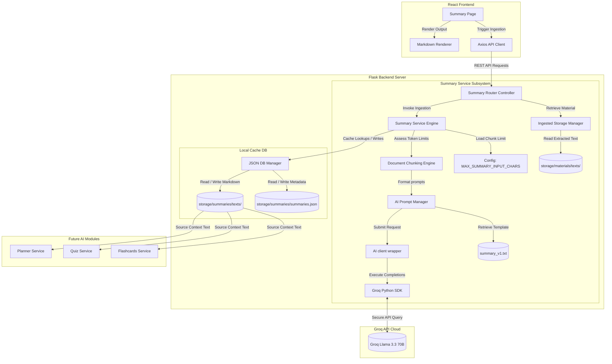

# Software Design Document: AI Summary Generator (Phase 4) — Revision 3

This document describes the updated architectural, security, API, service layer, prompt, and UI/UX design specifications for **Phase 4: AI Summary Generator** of the StudyAI application.

---

## 1. Overall Architecture

The Summary Generator acts as a downstream consumer of the uploaded materials ingested in Phase 2. It integrates with the AI client infrastructure established in Phase 3 to generate structured Markdown summaries and caches them locally. 

This revision introduces a **version history endpoint** and a **retention ceiling limit (maximum 5 versions)** to control storage footprint.



---

## 2. Ingestion & Storage Directories

To support scaling, the storage layout is organized into dedicated functional directories under `backend/storage/`:

```
backend/
└── storage/
    ├── materials/          # Material files and raw text segments (Phase 2)
    │   ├── materials.json
    │   └── texts/
    ├── summaries/          # Summaries index and versioned Markdowns (Phase 4)
    │   ├── summaries.json
    │   └── texts/
    │       ├── sum_mat_89410d9f_v1.md
    │       └── sum_mat_89410d9f_v2.md
    ├── analytics/          # Log sessions and performance files (Phase 9)
    └── cache/              # Dynamic session data fallback caching
```

---

## 3. Summary Generation & Versioning Policy

### Summary Versioning & Cleanup Policy
*   **Version Cap**: A maximum of **5 versions** are retained for any study material.
*   **Automatic Cleanup**: During summary regeneration, if the version count for a material reaches 5, the oldest summary file (e.g., version 1) and its corresponding metadata history record are permanently deleted from disk.
*   **Downstream Pipeline Prep**: Future modules (e.g., flashcard generator) can read the active generated `summary_markdown` version directly rather than reparsing raw document extractions.

---

## 4. Prompt Engineering (`summary_v1.txt`)

### Prompt Specification (`backend/services/ai/prompts/summary_v1.txt`)
```
You are an expert academic summarizing assistant. Your task is to analyze the provided study material and produce a comprehensive, structured study guide in Markdown.

Adhere to the following structural output rules:
1. Executive Summary: A concise 3-4 sentence paragraph summarizing the core theme.
2. Key Concepts: An organized bullet list detailing important terminology, definitions, and theories. Explain each concept clearly.
3. Detailed Outline: A hierarchical summary of the core sections of the text using appropriate Markdown headings (###, ####).
4. Core Takeaways & Summary: A concluding block highlighting the most critical points.
5. Study Tips: A blockquote section containing helpful tips for remembering this material.

Constraints:
- Use clear bullet points and hierarchical headers.
- If the source material contains scientific formulas or data tables, recreate them using LaTeX format or Markdown tables.
- Do NOT include introductory conversational greetings (e.g., "Here is your summary:") or concluding statements. Output ONLY the raw Markdown.
- Output text must be written in an educational, student-friendly tone.

[START OF STUDY MATERIAL CONTEXT]
{{ material_text }}
[END OF STUDY MATERIAL CONTEXT]
```

---

## 5. REST API Design

All endpoints reside under `/api/v1/summary`.

### 1. POST `/api/v1/summary/generate`
*   **Request Format**: `application/json`
    ```json
    {
      "material_id": "mat_89410d9f",
      "regenerate": false
    }
    ```
*   **Successful Response** (`201 Created`):
    ```json
    {
      "material_id": "mat_89410d9f",
      "summary_id": "sum_mat_89410d9f",
      "summary_version": 1,
      "title": "biology_notes Summary",
      "subject": "Biology",
      "summary_markdown": "# Executive Summary\n...",
      "summary_status": "generated",
      "ai_metadata": {
        "model": "llama-3.3-70b-versatile",
        "prompt_version": "summary_v1",
        "latency_ms": 1240,
        "prompt_tokens": 1500,
        "completion_tokens": 450,
        "total_tokens": 1950
      },
      "cached": false,
      "created_at": "2026-07-15T16:00:00Z"
    }
    ```

### 2. GET `/api/v1/summary/{material_id}`
*   **Purpose**: Fetch the active version of a material's summary.
*   **Successful Response** (`200 OK`):
    ```json
    {
      "material_id": "mat_89410d9f",
      "summary_id": "sum_mat_89410d9f",
      "summary_version": 1,
      "title": "biology_notes Summary",
      "subject": "Biology",
      "summary_markdown": "# Executive Summary\n...",
      "summary_status": "generated",
      "ai_metadata": {
        "model": "llama-3.3-70b-versatile",
        "prompt_version": "summary_v1",
        "latency_ms": 1240,
        "prompt_tokens": 1500,
        "completion_tokens": 450,
        "total_tokens": 1950
      },
      "created_at": "2026-07-15T16:00:00Z"
    }
    ```

### 3. GET `/api/v1/summary/{material_id}/history`
*   **Purpose**: Get version history metadata (excluding full markdown text blocks for speed).
*   **Successful Response** (`200 OK`):
    ```json
    {
      "material_id": "mat_89410d9f",
      "active_version": 2,
      "versions": [
        {
          "version": 1,
          "created_at": "2026-07-15T16:00:00Z",
          "model": "llama-3.3-70b-versatile",
          "word_count": 480
        },
        {
          "version": 2,
          "created_at": "2026-07-15T16:10:00Z",
          "model": "llama-3.3-70b-versatile",
          "word_count": 510
        }
      ]
    }
    ```

### 4. DELETE `/api/v1/summary/{material_id}`
*   **Purpose**: Delete all summary versions and reset `summary_status` to `"not_generated"` in `materials.json`.

---

## 6. Summary Storage Registry Schema

### JSON Schema (`storage/summaries/summaries.json`)
```json
{
  "summaries": [
    {
      "material_id": "mat_89410d9f",
      "summary_id": "sum_mat_89410d9f",
      "title": "biology_notes Summary",
      "subject": "Biology",
      "active_version": 2,
      "summary_status": "generated",
      "created_at": "2026-07-15T16:00:00Z",
      "updated_at": "2026-07-15T16:10:00Z",
      "history": [
        {
          "version": 1,
          "model": "llama-3.3-70b-versatile",
          "prompt_version": "summary_v1",
          "word_count": 480,
          "char_count": 3120,
          "markdown_file_path": "storage/summaries/texts/sum_mat_89410d9f_v1.md",
          "ai_metadata": {
            "latency_ms": 1240,
            "prompt_tokens": 1500,
            "completion_tokens": 450,
            "total_tokens": 1950
          },
          "created_at": "2026-07-15T16:00:00Z"
        },
        {
          "version": 2,
          "model": "llama-3.3-70b-versatile",
          "prompt_version": "summary_v1",
          "word_count": 510,
          "char_count": 3310,
          "markdown_file_path": "storage/summaries/texts/sum_mat_89410d9f_v2.md",
          "ai_metadata": {
            "latency_ms": 1180,
            "prompt_tokens": 1550,
            "completion_tokens": 480,
            "total_tokens": 2030
          },
          "created_at": "2026-07-15T16:10:00Z"
        }
      ]
    }
  ]
}
```

---

## 7. Configuration Mappings (`config.py` additions)

```python
class Config:
    # Character split threshold limit for chunking
    MAX_SUMMARY_INPUT_CHARS: int = int(os.getenv("MAX_SUMMARY_INPUT_CHARS", "30000"))
    MAX_SUMMARY_OVERLAP_CHARS: int = int(os.getenv("MAX_SUMMARY_OVERLAP_CHARS", "2000"))
    MAX_SUMMARY_TOTAL_LIMIT: int = 500000
    MAX_SUMMARY_VERSIONS_RETAINED: int = 5  # Keep maximum of 5 historical versions
```

---

## 8. Testing Strategy

### Pytest Cases
*   `test_generate_summary_version_increment`: Asserts version incrementing from `v1` to `v2` on regeneration.
*   `test_summary_version_limit_cleanup`: Asserts that when generating version 6, version 1 is automatically deleted from disk and the registry.
*   `test_get_summary_history_endpoint`: Asserts that `GET /api/v1/summary/{id}/history` returns the correct list structure.

---

## 9. Folder Structure Map

### New Folders
*   `backend/storage/summaries/`
*   `backend/storage/summaries/texts/`
*   `backend/storage/analytics/`
*   `backend/storage/cache/`

### New Files
*   `backend/services/ai/prompts/summary_v1.txt`
*   `backend/services/summary_service.py`
*   `backend/routes/summary.py`
*   `backend/tests/test_summary.py`

### Modified Files
*   `backend/routes/__init__.py`
*   `backend/config.py`
*   `frontend/src/constants/index.js`
*   `frontend/src/pages/Summary.jsx`
*   `frontend/src/pages/Dashboard.jsx` (displays status metrics)
