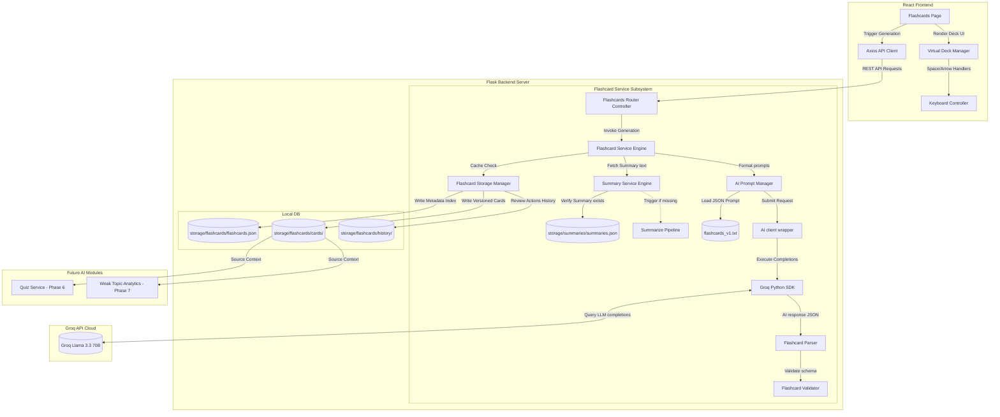

# Software Design Document: AI Flashcard Generator (Phase 5) — Revision 2

This document describes the updated architectural, security, API, service layer, prompt, and UI/UX design specifications for **Phase 5: AI Flashcard Generator** of the StudyAI application.

---

## 1. Overall Architecture

The Flashcard Generator acts as a downstream consumer of the Summary System developed in Phase 4. By generating study aids from clean summaries rather than the raw extracted text blocks, it reduces token usage and ensures high semantic relevance.

This revision introduces **spaced repetition placeholders** and **API consumption trackers** inside metadata models to simplify future migrations.



---

## 2. Ingestion & Storage Directories

To maintain modularity, the flashcard database registry resides under `backend/storage/flashcards/`:

```
backend/
└── storage/
    ├── flashcards/         # Flashcards index and versioned cards lists (Phase 5)
    │   ├── flashcards.json # Index mapping material IDs to active versions
    │   ├── cards/          # Raw lists of cards structured as JSON
    │   │   ├── fc_mat_89410d9f_v1.json
    │   │   └── fc_mat_89410d9f_v2.json
    │   └── history/        # Review sessions logs tracking answers
    │       └── hist_mat_89410d9f.json
```

---

## 3. Flashcard Generation Workflow

1.  **User Selects Material**: The student selects an uploaded document from a dropdown on the Flashcards Page.
2.  **Summary Check**: The `Flashcard Service` queries the Summary system for the material.
    *   *If Summary exists*: Reads the active summary markdown text.
    *   *If Summary does NOT exist*: Invokes `generate_summary` first, then reads the output.
3.  **Local Cache Check**: The `Flashcard Service` checks the `flashcards.json` registry. If cards exist and `regenerate=false`, it returns the active list of cards.
4.  **Prompt Interpolation**: The `Prompt Manager` loads `flashcards_v1.txt` and interpolates the summary markdown context.
5.  **Inference & AI Response Validation**: The `AI Client` executes completion calls using `llama-3.3-70b-versatile`. The response is validated by `FlashcardParser` to ensure it is valid JSON and contains the required schema.
6.  **Versioning & Version Cap**: If the user forces regeneration:
    *   The previous cards list is retained as `fc_{material_id}_v{old_version}.json`.
    *   Older files are automatically deleted if the count exceeds **5 versions**.
7.  **Client Deck Render**: The frontend receives the JSON list of flashcards, rendering interactive flip cards with keyboard shortcut support.

---

## 4. Prompt Engineering (`flashcards_v1.txt`)

### Prompt Specification (`backend/services/ai/prompts/flashcards_v1.txt`)
```
You are an expert academic tutor specializing in active-recall learning. Your task is to analyze the provided study summary and generate a structured JSON list of flashcards.

Adhere to the following JSON output format:
{
  "flashcards": [
    {
      "question": "Question text here?",
      "answer": "Clear, concise answer text here.",
      "topic": "Conceptual Topic Name",
      "difficulty": "easy" | "medium" | "hard",
      "tags": ["keyterm", "definition"]
    }
  ]
}

Constraints:
1. Generate between 8 and 15 highly educational flashcards covering the key definitions, concepts, and outline sections.
2. Questions must test active recall (avoid simple yes/no questions).
3. Answers must be high-impact, conceptual, and concise (1-3 sentences maximum).
4. Output MUST be valid, raw JSON. Do NOT include markdown code blocks (e.g. ```json), descriptions, or warnings. Output ONLY the JSON string.

[START OF SUMMARY CONTEXT]
{{ summary_markdown }}
[END OF SUMMARY CONTEXT]
```

---

## 5. Flashcard Object & Database Schema

### Individual Flashcard Schema (with Spaced Repetition Fields)
```json
{
  "flashcard_id": "fc_7b38d901",
  "material_id": "mat_89410d9f",
  "summary_version": 2,
  "question": "What is the primary function of Mitochondria?",
  "answer": "Mitochondria generate most of the chemical energy needed to power the cell's biochemical reactions, stored as ATP.",
  "topic": "Cell Biology",
  "difficulty": "medium",
  "tags": ["organelle", "biology"],
  "created_at": "2026-07-15T16:00:00Z",
  "updated_at": "2026-07-15T16:00:00Z",
  "mastered": false,
  "review_count": 0,
  "last_reviewed": null,
  "next_review": null,
  "ease_factor": 2.5,
  "interval_days": 1
}
```

### JSON Schema (`storage/flashcards/flashcards.json` with AI Metadata Tracking)
```json
{
  "flashcards_registry": [
    {
      "material_id": "mat_89410d9f",
      "active_version": 2,
      "created_at": "2026-07-15T16:00:00Z",
      "updated_at": "2026-07-15T16:10:00Z",
      "history": [
        {
          "version": 1,
          "cards_file_path": "storage/flashcards/cards/fc_mat_89410d9f_v1.json",
          "created_at": "2026-07-15T16:00:00Z",
          "ai_metadata": {
            "model": "llama-3.3-70b-versatile",
            "prompt_version": "flashcards_v1",
            "latency_ms": 940,
            "prompt_tokens": 1280,
            "completion_tokens": 580,
            "total_tokens": 1860
          }
        },
        {
          "version": 2,
          "cards_file_path": "storage/flashcards/cards/fc_mat_89410d9f_v2.json",
          "created_at": "2026-07-15T16:10:00Z",
          "ai_metadata": {
            "model": "llama-3.3-70b-versatile",
            "prompt_version": "flashcards_v1",
            "latency_ms": 980,
            "prompt_tokens": 1320,
            "completion_tokens": 610,
            "total_tokens": 1930
          }
        }
      ]
    }
  ]
}
```

---

## 6. REST API Design

All endpoints reside under `/api/v1/flashcards`.

### 1. POST `/api/v1/flashcards/generate`
*   **Purpose**: Generate flashcards for a specific study material.
*   **Request Format**: `application/json`
    ```json
    {
      "material_id": "mat_89410d9f",
      "regenerate": false
    }
    ```
*   **Successful Response** (`201 Created` or `200 OK` if cached):
    ```json
    {
      "material_id": "mat_89410d9f",
      "active_version": 1,
      "flashcards": [
        {
          "flashcard_id": "fc_7b38d901",
          "question": "What is Mitochondria?",
          "answer": "...",
          "topic": "Cell Biology",
          "difficulty": "medium",
          "tags": ["biology"],
          "mastered": false,
          "review_count": 0,
          "next_review": null,
          "ease_factor": 2.5,
          "interval_days": 1
        }
      ],
      "ai_metadata": {
        "model": "llama-3.3-70b-versatile",
        "prompt_version": "flashcards_v1",
        "latency_ms": 980,
        "prompt_tokens": 1320,
        "completion_tokens": 610,
        "total_tokens": 1930
      },
      "cached": false
    }
    ```

### 2. GET `/api/v1/flashcards/{material_id}`
*   **Purpose**: Retrieve flashcards associated with a study material.

### 3. GET `/api/v1/flashcards/{material_id}/history`
*   **Purpose**: Retrieve version history lists.

### 4. PATCH `/api/v1/flashcards/{flashcard_id}/mastered`
*   **Purpose**: Toggle a card's mastery state.

### 5. PATCH `/api/v1/flashcards/{flashcard_id}/review`
*   **Purpose**: Record review outcomes (spaced repetition tracking).

### 6. DELETE `/api/v1/flashcards/{material_id}`
*   **Purpose**: Delete all version files and history mappings.

---

## 7. Backend Service Subsystem

*   **`FlashcardService`**: Orchestrates summary lookups, handles text chunks if summary files exceed prompt size limits, and triggers LLM generation.
*   **`FlashcardStorageService`**: Coordinates JSON registry reads/writes, manages review history logs, and handles version pruning (cleaning up versions > 5).
*   **`FlashcardParser`**: Sanitizes markdown envelopes, extracts raw JSON objects, and converts them to list payloads.
*   **`FlashcardValidator`**: Validates the cards' parameters.

---

## 8. Frontend Design & UI/UX

The frontend implements an interactive study view inside `pages/Flashcards.jsx`.

### UI Components
*   **Deck Component**: Displays the active flashcard with a flipping card interface.
*   **Navigation Panel**: Previous and next controls with card indexes (e.g. `Card 4 of 12`).
*   **Filter & Search Bar**: Filter by subject/difficulty, search by text, and toggle to exclude mastered cards.
*   **Progress Dashboard Indicator**: Real-time stats showing:
    *   *Learning Progress*: `[Mastered Count] / [Total Cards]`.
    *   *Progress Bar*: Dynamic percentage visualization.

### UX Interaction Specs
*   **Flip Animation**: A 3D flip animation using CSS perspective and transform properties:
    ```css
    transform: rotateY(180deg);
    transition: transform 0.6s;
    transform-style: preserve-3d;
    ```
*   **Keyboard Shortcuts**:
    *   `Space`: Flip Card.
    *   `ArrowLeft`: Previous Card.
    *   `ArrowRight`: Next Card.
*   **Mobile Swiping**: Swiping right marks a card as mastered, swiping left goes back.

---

## 9. Performance & Security Controls

*   **Lazy Loading**: Cards lists are loaded only when requested.
*   **Summary Length Enforcements**: Capped at 50,000 characters before invoking flashcards prompts.
*   **JSON Shield**: If the parser fails, the validator triggers a structured JSON recovery sequence to salvage valid cards.

---

## 10. Testing Strategy

### Pytest Cases
*   `test_generate_flashcards_from_summary`: Verifies generating flashcards from an existing summary.
*   `test_generate_flashcards_no_summary`: Verifies the service automatically generates a summary first if one is missing.
*   `test_mastery_state_updates`: Verifies toggle updates to registry index parameters.
*   `test_invalid_json_recovery`: Simulates malformed JSON, asserting parsing failure handling.
*   `test_history_retention_cleanup`: Confirms that versions > 5 are purged during regeneration.

---

## 11. Folder Structure Map

### New Folders
*   `backend/storage/flashcards/`
*   `backend/storage/flashcards/cards/`
*   `backend/storage/flashcards/history/`

### New Files
*   `backend/services/ai/prompts/flashcards_v1.txt`
*   `backend/services/flashcard_service.py`
*   `backend/routes/flashcards.py`
*   `backend/tests/test_flashcards.py`

### Modified Files
*   `backend/routes/__init__.py`
*   `backend/config.py`
*   `frontend/src/constants/index.js`
*   `frontend/src/pages/Flashcards.jsx`
*   `frontend/src/pages/Dashboard.jsx` (embeds stats trackers and recent activity metrics)

---

## 12. Git Workflow

Commit iteratively during Phase 5:

*   `feat(backend): create flashcard prompt template and database directories`
*   `feat(backend): implement flashcard parser, validator, and storage services`
*   `feat(backend): build REST API routes for generation, history, and status updates`
*   `feat(frontend): build interactive flashcard page with 3D flip animations and filters`
*   `feat(frontend): implement keyboard shortcuts and swipe gesture controls`
*   `test: create pytest unit tests verifying flashcard parsing and cache systems`

---

## 13. Acceptance Criteria

1.  **AI Pipeline Completes**: Selecting a material generates structured active-recall JSON flashcards using the material's summary.
2.  **Auto Summary Ingestion**: If a summary is missing, the service generates one before producing flashcards.
3.  **Metrics Update**: Toggling mastery and recording reviews correctly updates stats and saves parameters.
4.  **UI Animation Operates**: The card flips smoothly using 3D transitions.
5.  **Clean Cache Cleanup**: Regenerating prunes history files correctly, maintaining a maximum of 5 versions.
