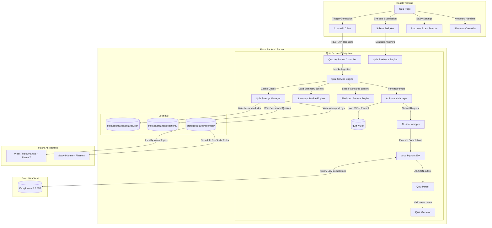

# Software Design Document: AI Quiz Generator (Phase 6) — Revision 2

This document describes the updated architectural, security, API, service layer, prompt, and UI/UX design specifications for **Phase 6: AI Quiz Generator** of the StudyAI application.

---

## 1. Overall Architecture

The Quiz Generator acts as a downstream consumer of the Summary (Phase 4) and Flashcard (Phase 5) systems. To optimize performance and API cost, the generator prioritizes existing summary markdown and flashcard registries as study contexts instead of reparsing raw documents.

This revision introduces **question order tracking** and **float marks placeholders** to allow partial credit calculations in future modules.



---

## 2. Ingestion & Storage Directories

All quiz assets are organized under `backend/storage/quizzes/`:

```
backend/
└── storage/
    ├── quizzes/            # Quizzes index and question lists (Phase 6)
    │   ├── quizzes.json    # Index mapping material IDs to active versions
    │   ├── questions/      # Versioned quiz schemas structured as JSON
    │   │   ├── qz_mat_89410d9f_v1.json
    │   │   └── qz_mat_89410d9f_v2.json
    │   ├── attempts/       # User quiz attempts logs (per material/quiz ID)
    │   │   └── att_mat_89410d9f.json
    │   └── history/        # Diagnostic runs and performance records
```

---

## 3. Quiz Workflow

1.  **User Selects Material**: The student selects a study material from the dropdown on the Quiz Page.
2.  **Context Assembly Priority**:
    *   *Step 1*: Check if summary exists. If not, trigger summary generation.
    *   *Step 2*: Check if flashcard deck exists. If not, trigger flashcard generation.
    *   *Step 3*: Load summary markdown + flashcard JSON as study contexts, falling back to raw extracted material text only if both fail.
3.  **Local Cache Check**: The `Quiz Service` checks the `quizzes.json` cache registry. If a quiz exists for the material and `regenerate=false`, it returns the active quiz.
4.  **Prompt Interpolation**: The `Prompt Manager` loads `quiz_v1.txt` and interpolates context parameters.
5.  **Inference & AI Response Validation**: The `AI Client` executes completion calls using Llama 3.3. The response is validated by `QuizParser` to ensure it is valid JSON and contains the required schema.
6.  **Quiz Presentation**: The frontend loads the questions, rendering them one at a time with practice/exam modes.
7.  **Evaluation & Attempt Saving**: When the user clicks "Submit", the `Quiz Evaluator Engine` scores the responses, logs correct/wrong answers, and appends a record to `attempts/att_{material_id}.json` for future Weak Topic Analysis.

---

## 4. Prompt Engineering (`quiz_v1.txt`)

### Prompt Specification (`backend/services/ai/prompts/quiz_v1.txt`)
```
You are an expert academic tutor specializing in testing student knowledge. Your task is to analyze the provided study context and generate a structured JSON list of quiz questions.

Adhere to the following JSON output format:
{
  "questions": [
    {
      "question_type": "mcq" | "true_false" | "short_answer",
      "question": "Question text here?",
      "topic": "Conceptual Topic Name",
      "difficulty": "easy" | "medium" | "hard",
      "choices": ["Option A", "Option B", "Option C", "Option D"],
      "correct_answer": "Correct Option Text or True/False value or Short Key phrase",
      "explanation": "Detailed explanation explaining why this answer is correct."
    }
  ]
}

Constraints:
1. Generate between 5 and 10 questions of varying types (MCQ, True/False, and Short Answer).
2. For "true_false" questions, "choices" must be ["True", "False"].
3. For "short_answer" questions, "choices" must be empty []. The correct answer must be a key conceptual term or phrase.
4. Output MUST be valid, raw JSON. Do NOT include markdown code blocks (e.g. ```json), descriptions, or warnings. Output ONLY the JSON string.

[START OF STUDY CONTEXT]
Summary Context:
{{ summary_markdown }}

Flashcards Context:
{{ flashcards_json }}
[END OF STUDY CONTEXT]
```

---

## 5. Quiz Object & Database Schema

### Quiz Question Schema
```json
{
  "question_id": "q_f581cd92",
  "question_type": "mcq",
  "question": "What is the primary product of cell respiration?",
  "topic": "Cellular Metabolism",
  "difficulty": "medium",
  "choices": ["Lactic Acid", "Glucose", "Adenosine Triphosphate (ATP)", "Carbon Dioxide"],
  "correct_answer": "Adenosine Triphosphate (ATP)",
  "explanation": "Cellular respiration converts biochemical energy from nutrients into adenosine triphosphate (ATP), the primary energy currency of cells."
}
```

### Quiz Attempt Registry Schema (`storage/quizzes/attempts/att_mat_89410d9f.json`)
Every attempt is saved permanently to provide diagnostic logs for Weak Topic Analysis (Phase 7):
```json
[
  {
    "attempt_id": "att_f4b8d91c",
    "quiz_id": "qz_mat_89410d9f",
    "quiz_version": 1,
    "mode": "exam",
    "time_taken_seconds": 185,
    "completed_at": "2026-07-15T16:15:00Z",
    "question_order": ["q_f581cd92", "q_d827ac9f"],
    "metrics": {
      "total_questions": 5,
      "answered_count": 5,
      "correct_count": 4,
      "wrong_count": 1,
      "skipped_count": 0,
      "obtained_marks": 4.0,
      "total_marks": 5.0,
      "score_percentage": 80.0,
      "average_difficulty": "medium"
    },
    "responses": [
      {
        "question_id": "q_f581cd92",
        "question_type": "mcq",
        "topic": "Cellular Metabolism",
        "difficulty": "medium",
        "student_answer": "Adenosine Triphosphate (ATP)",
        "correct_answer": "Adenosine Triphosphate (ATP)",
        "is_correct": true,
        "marks": 1.0,
        "obtained_marks": 1.0,
        "explanation": "Cellular respiration converts biochemical energy..."
      },
      {
        "question_id": "q_d827ac9f",
        "question_type": "true_false",
        "topic": "Cell Walls",
        "difficulty": "easy",
        "student_answer": "False",
        "correct_answer": "True",
        "is_correct": false,
        "marks": 1.0,
        "obtained_marks": 0.0,
        "explanation": "Plant cells contain rigid cell walls..."
      }
    ]
  }
]
```

---

## 6. REST API Design

All endpoints reside under `/api/v1/quizzes`.

### 1. POST `/api/v1/quizzes/generate`
*   **Purpose**: Generate a quiz for a specific study material.
*   **Request Format**: `application/json`
    ```json
    {
      "material_id": "mat_89410d9f",
      "regenerate": false
    }
    ```
*   **Successful Response** (`201 Created` or `200 OK` if cached):
    ```json
    {
      "material_id": "mat_89410d9f",
      "quiz_id": "qz_mat_89410d9f",
      "active_version": 1,
      "questions": [
        {
          "question_id": "q_f581cd92",
          "question_type": "mcq",
          "question": "What is Mitochondria?",
          "choices": ["A", "B", "C", "D"],
          "difficulty": "easy",
          "topic": "Organelles"
        }
      ],
      "cached": false
    }
    ```

### 2. GET `/api/v1/quizzes/{material_id}`
*   **Purpose**: Fetch the active quiz questions.

### 3. GET `/api/v1/quizzes/{material_id}/history`
*   **Purpose**: Retrieve lists of previous attempts and versions.

### 4. POST `/api/v1/quizzes/{quiz_id}/submit`
*   **Purpose**: Evaluate a completed quiz attempt.
*   **Request Format**: `application/json`
    ```json
    {
      "material_id": "mat_89410d9f",
      "quiz_version": 1,
      "mode": "exam",
      "time_taken_seconds": 120,
      "question_order": ["q_f581cd92", "q_d827ac9f"],
      "answers": {
        "q_f581cd92": "Adenosine Triphosphate (ATP)",
        "q_d827ac9f": "False"
      }
    }
    ```
*   **Successful Response** (`201 Created`):
    ```json
    {
      "attempt_id": "att_f4b8d91c",
      "metrics": {
        "total_questions": 5,
        "correct_count": 4,
        "obtained_marks": 4.0,
        "total_marks": 5.0,
        "score_percentage": 80.0
      },
      "responses": [
        {
          "question_id": "q_f581cd92",
          "student_answer": "Adenosine Triphosphate (ATP)",
          "correct_answer": "Adenosine Triphosphate (ATP)",
          "is_correct": true,
          "marks": 1.0,
          "obtained_marks": 1.0,
          "explanation": "..."
        }
      ]
    }
    ```

### 5. DELETE `/api/v1/quizzes/{material_id}`
*   **Purpose**: Delete the quiz index and questions. (Preserves attempts history logs under `attempts/` for analytics).

---

## 7. Backend Service Subsystem

*   **`QuizService`**: Manages context aggregation, checks summary/flashcard versions, and triggers LLM quiz completions.
*   **`QuizStorageService`**: Coordinates index writes, logs version mappings, handles the 5-version cache cleanup ceiling, and appends attempt records.
*   **`QuizParser`**: Sanitizes code block tags and extracts raw JSON question dictionaries.
*   **`QuizValidator`**: Validates the questions list schema (valid MCQ choices, non-empty questions/answers).
*   **`QuizEvaluator`**: Scores answers (supporting float mappings for partial credits), handles string matches for short answers, and computes aggregate attempt metrics.

---

## 8. Frontend Design & UI/UX

The frontend implements an interactive study view inside `pages/Quiz.jsx`.

### UI Components
*   **Practice / Exam Selector**:
    *   *Practice Mode*: Show instant feedback (explanations) after answering each question.
    *   *Exam Mode*: Hide explanations. Show progress bar, question selector palette, and active timer (e.g. `20:00` count down).
*   **Question Navigation Palette**: Displays grid dots representing questions:
    *   `Grey Dot`: Unanswered.
    *   `Blue Dot`: Answered.
    *   `Purple Dot`: Marked for Review.
*   **Review Mode View**: Renders the complete scored quiz outline showing correct options, explanation panels, and student responses.

### Keyboard Shortcuts
*   `ArrowLeft`: Move to previous question.
*   `ArrowRight`: Move to next question.
*   `1, 2, 3, 4`: Select option A, B, C, or D for MCQs.
*   `Space`: Submit or mark for review.

---

## 9. Performance & Caching Strategy

*   **Registry Cache lookups**: Prevents duplicate LLM completions by resolving active cached quizzes from disk.
*   **Virtualization**: Questions lists are loaded into client state only when study is initialized.
*   **Timer Intervals**: Configured using React state hooks with cleanup functions to prevent memory leaks.

---

## 10. Testing Strategy

### Pytest Cases
*   `test_generate_quiz_from_summary_and_flashcards`: Verifies generating a quiz from existing summaries and flashcards.
*   `test_generate_quiz_fallback_extracted_text`: Verifies falling back to raw text if no summary or float marks exists.
*   `test_quiz_attempt_persistence`: Asserts that submitting a quiz appends a persistent attempt log with scores.
*   `test_history_cleanup_ceiling`: Confirms that versions > 5 are purged during regeneration.
*   `test_evaluation_matching_short_answer`: Verifies that short answers match correctly (case-insensitive, whitespace-trimmed).

---

## 11. Folder Structure Map

### New Folders
*   `backend/storage/quizzes/`
*   `backend/storage/quizzes/questions/`
*   `backend/storage/quizzes/attempts/`

### New Files
*   `backend/services/ai/prompts/quiz_v1.txt`
*   `backend/services/quiz_service.py`
*   `backend/routes/quizzes.py`
*   `backend/tests/test_quizzes.py`

### Modified Files
*   `backend/routes/__init__.py`
*   `backend/config.py`
*   `frontend/src/constants/index.js`
*   `frontend/src/pages/Quiz.jsx`
*   `frontend/src/pages/Dashboard.jsx` (embeds quiz metrics, best scores, and recent attempts panels)

---

## 12. Git Workflow

Commit iteratively during Phase 6:

*   `feat(backend): create quiz prompt template and database directories`
*   `feat(backend): implement quiz services, validators, and SM2 scorers`
*   `feat(backend): build REST API routes for generation, submit, and history logs`
*   `feat(frontend): build interactive quiz page with practice/exam settings and timers`
*   `feat(frontend): build question palette navigation and keyboard shortcuts`
*   `test: create pytest unit tests verifying evaluations engine and fallbacks`

---

## 13. Acceptance Criteria

1.  **Context Reuse Completes**: Selecting a material loads questions using summaries and flashcards.
2.  **Scoring Engine Evaluates Correctly**: MCQ, True/False, and Short Answer responses are scored correctly, calculating overall accuracy and elapsed times.
3.  **Attempts Logs Persist**: Quiz attempts are permanently recorded, including difficulty, topic tags, correct answers, and student responses.
4.  **UI Modes Function**: Practice and Exam timed configurations load properly with working navigation selectors.
5.  **History Pruning Completes**: Regenerating prunes history files correctly, maintaining a maximum of 5 quiz versions.
