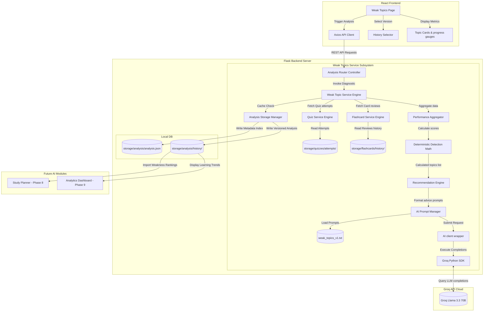

# Software Design Document: Weak Topic Analysis Engine (Phase 7)

This document describes the architectural, security, API, service layer, prompt, and UI/UX design specifications for **Phase 7: Weak Topic Analysis Engine** of the StudyAI application.

---

## 1. Overall Architecture

The Weak Topic Analysis Engine operates as a **deterministic diagnostic subsystem**. Rather than relying on AI to perform calculations (which can introduce latency, cost, and hallucinated scores), this engine runs a local mathematical aggregator over student actions logs. The AI client is invoked only *after* calculations are complete to generate personalized revision advice.



---

## 2. Analysis Workflow

1.  **Student Initiates Run**: The student clicks "Generate Weak Topics Analysis" for a selected study material.
2.  **Ingestion Phase**: The `PerformanceAggregator` queries:
    *   **Quiz attempts logs**: Retrieves all attempts from `storage/quizzes/attempts/att_mat_{id}.json` (matching question_ids, correct/student answers, topics, difficulties, and time limits).
    *   **Flashcard review histories**: Loads review sessions logs from `storage/flashcards/history/hist_mat_{id}.json` (matching cards reviewed, interval multipliers, and mastery toggles).
    *   **Summary files**: Extracts summary headings to check topic boundaries.
3.  **Aggregation Phase**: Aggregates correct vs wrong counts, average elapsed times, total reviews, and mastery toggles grouped by **Topic**.
4.  **Deterministic Scoring Calculation**: Runs the detection algorithm to calculate Topic Accuracy, Mastery Percentage, and Weakness Score.
5.  **AI Recommendations Ingestion**: Sends the top detected weak topics and scoring details to Llama 3.3 using the `weak_topics_v1.txt` template to generate personalized revision priorities.
6.  **Versioning & Cache Registry**: Saves the resulting analysis JSON to `storage/analysis/history/an_mat_{id}_v{version}.json` and prunes versions beyond 5.
7.  **Client Presentation**: Renders the analysis dashboard with custom topic cards, progress gauges, accuracy indicators, confidence badges, and recommendation alerts.

---

## 3. Weak Topic Detection Algorithm

Weak topic classification is calculated **deterministically** using a weighted penalty scoring engine:

$$\text{Topic Score} = (w_q \times \text{Quiz Accuracy}) + (w_f \times \text{Flashcard Mastery}) - (w_t \times \text{Time Penalty}) - (w_d \times \text{Difficulty Penalty})$$

### Weighted Parameters Design
*   **Quiz Accuracy Weight ($w_q = 0.50$)**:
    $$\text{Quiz Accuracy} = \frac{\text{Correct Quiz Answers for Topic}}{\text{Total Quiz Attempts for Topic}}$$
*   **Flashcard Mastery Weight ($w_f = 0.30$)**:
    $$\text{Flashcard Mastery} = \frac{\text{Mastered Cards in Topic}}{\text{Total Cards in Topic}}$$
*   **Time Penalty Weight ($w_t = 0.10$)**:
    Assesses if a student takes longer than the average response time.
*   **Difficulty Weight ($w_d = 0.10$)**:
    Applies a minor weight shift if the questions are classified as hard (giving students more leniency).

### Weakness Level Classification Boundaries
*   **$85\% - 100\%$**: `Excellent` (Green)
*   **$70\% - 84\%$**: `Good` (Blue)
*   **$50\% - 69\%$**: `Needs Review` (Yellow)
*   **$30\% - 49\%$**: `Weak` (Orange)
*   **$0\% - 29\%$**: `Critical` (Red)

---

## 4. Topic Schema

The analysis result tracks topic performance metrics, AI metadata, and downstream compatibility fields:

```json
{
  "analysis_id": "an_mat_89410d9f",
  "material_id": "mat_89410d9f",
  "active_version": 2,
  "summary_version": 2,
  "flashcard_version": 1,
  "quiz_version": 1,
  "created_at": "2026-07-15T16:00:00Z",
  "updated_at": "2026-07-15T16:00:00Z",
  
  "dashboard_preparation": {
    "average_accuracy": 74.5,
    "weak_topic_count": 2,
    "strong_topic_count": 3,
    "learning_trend": "improving" // regression | stable | improving
  },
  
  "topics_analysis": [
    {
      "topic": "Cellular Metabolism",
      "difficulty": "medium",
      "attempts": 12,
      "correct_answers": 9,
      "wrong_answers": 3,
      "accuracy": 75.0,
      "mastery_score": 80.0,
      "confidence_score": 77.5,
      "weakness_level": "Good",
      "recommended_action": "Review medium difficulty questions to lock in details."
    },
    {
      "topic": "DNA Structure",
      "difficulty": "hard",
      "attempts": 8,
      "correct_answers": 2,
      "wrong_answers": 6,
      "accuracy": 25.0,
      "mastery_score": 30.0,
      "confidence_score": 27.0,
      "weakness_level": "Critical",
      "recommended_action": "Re-study double-helix nucleotide pairings immediately."
    }
  ],
  
  "ai_recommendations": {
    "personalized_advice": "Focus heavily on DNA Structure definitions. Review nucleotide pairings flashcards first before retaking chemistry quizzes.",
    "revision_priorities": [
      "DNA pairing rules",
      "Cell division outlines"
    ],
    "learning_strategy": "Spaced recall: review DNA pairings 3 times daily."
  },
  
  "ai_metadata": {
    "model": "llama-3.3-70b-versatile",
    "prompt_version": "weak_topics_v1",
    "latency_ms": 780,
    "prompt_tokens": 1200,
    "completion_tokens": 420,
    "total_tokens": 1620
  }
}
```

---

## 5. Storage Architecture

All analysis outputs reside under `backend/storage/analysis/`:

```
backend/
└── storage/
    ├── analysis/           # Diagnostic analysis outputs (Phase 7)
    │   ├── analysis.json   # Index registry mapping materials to active versions
    │   └── history/        # Versioned records structured as JSON
    │       ├── an_mat_89410d9f_v1.json
    │       └── an_mat_89410d9f_v2.json
```

---

## 6. AI Recommendation Layer (`weak_topics_v1.txt`)

### Prompt Specification (`backend/services/ai/prompts/weak_topics_v1.txt`)
```
You are an expert academic study strategist. Your task is to analyze the student's deterministic performance diagnostics and generate personalized study suggestions, priorities, and strategies.

Adhere to the following JSON output format:
{
  "personalized_advice": "High-impact study advice paragraph here.",
  "revision_priorities": [
    "Priority Topic Outline 1",
    "Priority Topic Outline 2"
  ],
  "learning_strategy": "Practical, step-by-step revision strategy."
}

Constraints:
1. Do NOT perform any scoring calculations. Trust the provided accuracy, mastery, and weakness level data implicitly.
2. Focus on revision advice for topics classified as "Critical" or "Weak".
3. Advice must be actionable and encouraging.
4. Output MUST be valid, raw JSON. Do NOT include markdown code blocks (e.g. ```json), descriptions, or warnings. Output ONLY the JSON string.

[START OF PERFORMANCE DIAGNOSTICS]
Average Accuracy: {{ average_accuracy }}%
Weak Topics Detected:
{{ weak_topics_list }}
[END OF PERFORMANCE DIAGNOSTICS]
```

---

## 7. REST API Design

All endpoints reside under `/api/v1/analysis`.

### 1. POST `/api/v1/analysis/generate`
*   **Purpose**: Trigger performance aggregation, run calculations, query AI advice, and save the versioned result.
*   **Request Format**: `application/json`
    ```json
    {
      "material_id": "mat_89410d9f",
      "regenerate": false
    }
    ```
*   **Successful Response** (`201 Created` or `200 OK` if cached):
    Returns the complete analysis JSON payload.

### 2. GET `/api/v1/analysis/{material_id}`
*   **Purpose**: Retrieve the active versioned analysis.

### 3. GET `/api/v1/analysis/{material_id}/history`
*   **Purpose**: Retrieve lists of previous version records.

### 4. DELETE `/api/v1/analysis/{material_id}`
*   **Purpose**: Delete active registers and versioned JSON files.

---

## 8. Backend Service Subsystem

*   **`WeakTopicService`**: Manages the diagnostic pipeline, invokes summaries status checks, handles fallbacks, and triggers AI recommendations calls.
*   **`PerformanceAggregator`**: Gathers attempts datasets from quizzes and flashcard histories, mapping records by topic names.
*   **`RecommendationService`**: Formats prompts, queries completions, and parses AI output responses.
*   **`AnalysisStorageService`**: Coordinates local metadata reads/writes, indexing versions, and cleaning records when version count > 5.

---

## 9. Frontend Design & UI/UX

The frontend implements a dashboard inside `pages/WeakTopics.jsx`.

### UI Components
*   **Material Selection & Generate trigger**: Standard header dropdown selector.
*   **Diagnostic Gauge Cards**: Summary panel showing:
    *   *Average Accuracy Percentage* (color-coded circular indicator).
    *   *Confidence Badge*: High / Medium / Low based on data size (attempts count).
*   **Topics Breakdown Grid**: Color-coded topic cards:
    *   `Excellent` (Green, accuracy > 85%)
    *   `Good` (Blue, 70% - 84%)
    *   `Needs Review` (Yellow, 50% - 69%)
    *   `Weak` (Orange, 30% - 49%)
    *   `Critical` (Red, < 30%)
*   **Progress Bars**: Visualizes correct vs incorrect answers per topic.
*   **AI Recommendation Panel**: Displays revision priorities, tips, and strategies.
*   **History Selector Dropdown**: Enables students to view and compare previous analysis logs.

---

## 10. Security & Performance Controls

*   **Lazy Loading**: Ingestion datasets are parsed only when generating analysis.
*   **Missing Data Fallbacks**:
    *   *No quiz attempts or reviews*: Returns a clean warning state prompting the user to take a quiz or review flashcards first.
    *   *Zero correct answers*: Sets accuracy to 0% without crashing (preventing divide-by-zero errors).
*   **Completions Guard**: Filters template variables to prevent prompt injection.

---

## 11. Testing Strategy

### Pytest Cases
*   `test_deterministic_scoring_calculations`: Asserts math scores match expected accuracy, mastery, and weakness level mappings.
*   `test_missing_quiz_attempts_fallbacks`: Asserts returning appropriate error bounds when no attempts logs exist.
*   `test_version_history_caps_cleanup`: Confirms that versions > 5 are purged during regeneration.
*   `test_recommendation_parser_safety`: Verifies parsing of malformed JSON recommendations responses.

---

## 12. Folder Structure Map

### New Folders
*   `backend/storage/analysis/`
*   `backend/storage/analysis/history/`

### New Files
*   `backend/services/ai/prompts/weak_topics_v1.txt`
*   `backend/services/analysis_service.py`
*   `backend/routes/analysis.py`
*   `backend/tests/test_analysis.py`

### Modified Files
*   `backend/routes/__init__.py`
*   `backend/config.py`
*   `frontend/src/constants/index.js`
*   `frontend/src/pages/WeakTopics.jsx`
*   `frontend/src/pages/Dashboard.jsx` (embeds weak topics counts and learning trend stats cards)

---

## 13. Git Workflow

Commit iteratively during Phase 7:

*   `feat(backend): create analysis prompt template and database directories`
*   `feat(backend): implement aggregator services and deterministic scoring algorithm`
*   `feat(backend): build REST API routes for generation, query list, and delete`
*   `feat(frontend): build diagnostic page with topic status indicators and recommendations`
*   `feat(frontend): implement history selector and dashboard metrics integration`
*   `test: create pytest unit tests verifying scoring calculations and fallbacks`

---

## 14. Deliverables

*   **Files Created**:
    *   `backend/services/ai/prompts/weak_topics_v1.txt`
    *   `backend/services/analysis_service.py`
    *   `backend/routes/analysis.py`
    *   `backend/tests/test_analysis.py`
*   **Files Modified**:
    *   `backend/routes/__init__.py`
    *   `frontend/src/constants/index.js`
    *   `frontend/src/pages/WeakTopics.jsx` (New frontend view)
    *   `frontend/src/pages/Dashboard.jsx`

---

## 15. Acceptance Criteria

1.  **Deterministic Scoring Completes**: Weak topic classification uses exact calculations based on correctness ratio parameters, not AI completions.
2.  **No Calculations in Prompts**: The AI prompt only handles study strategies and revision recommendations.
3.  **Attempts Logs Parsed**: Ingestion parsing reads all attempts logs and flashcard session results.
4.  **Classification Color Mappings Operate**: Red, Orange, Yellow, Blue, and Green priority levels display correctly based on calculated thresholds.
5.  **History Pruning Completes**: Regenerating prunes history files correctly, maintaining a maximum of 5 analysis versions.
