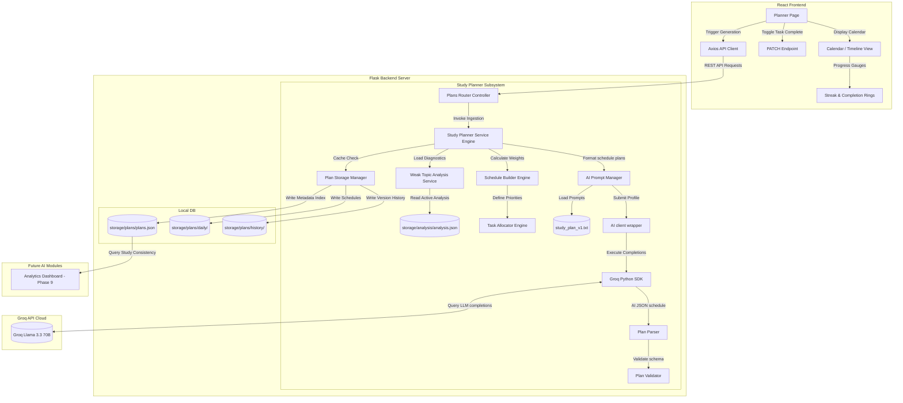

# Software Design Document: Personalized Study Planner (Phase 8)

This document describes the architectural, security, API, service layer, prompt, and UI/UX design specifications for **Phase 8: Personalized Study Planner** of the StudyAI application.

---

## 1. Overall Architecture

The Personalized Study Planner acts as a high-level aggregator, coordinating data from the Summary (Phase 4), Flashcards (Phase 5), Quizzes (Phase 6), and Weak Topic Analysis (Phase 7) modules. Rather than asking the AI to compute topic priorities, the planner uses **deterministic business logic** to categorize topics by priority and passes this structured learning profile to the Groq AI client to format a calendar schedule.



---

## 2. Study Planning Workflow

1.  **Student Selects Material**: The student selects a study material, target exam date, preferred duration (7/14/30 days), daily study hours limit, and time-of-day preference (Morning/Afternoon/Evening).
2.  **Diagnostics Ingestion**: The `StudyPlannerService` loads the active **Weak Topic Analysis** JSON for the material.
    *   *If no analysis exists*: Triggers analysis generation first (which itself falls back to summary/flashcards requirements checks).
3.  **Deterministic Allocation & Weight Calculations**: The `ScheduleBuilder` executes the prioritizer calculations, sorting topics by weakness levels and mapping out required hours per topic.
4.  **Prompt Assembly**: The `Prompt Manager` loads `study_plan_v1.txt` and interpolates the structured learning profile, preferences, and calculated topic allocations.
5.  **LLM Call & Plan Sanitization**: The `AI Client` executes completions using Llama 3.3. `PlanParser` sanitizes code block envelopes, extracting the raw JSON daily schedules.
6.  **Validation**: `PlanValidator` verifies that every task has a valid task type, priority level, estimated minutes, and unique task ID.
7.  **Saves Registry**: Persistence writes to `/plans/daily/` and updates the index registry. Prunes history logs beyond 5 versions.
8.  **Client Presentation**: Renders today's task checklist, timeline flows, streaks metrics, and progress rings.

---

## 3. Planner Prompt Engineering (`study_plan_v1.txt`)

### Prompt Specification (`backend/services/ai/prompts/study_plan_v1.txt`)
```
You are an expert academic coordinator. Your task is to transform the provided structured learning diagnostics and preferences into a structured, daily JSON study plan.

Adhere to the following JSON output format:
{
  "daily_schedule": [
    {
      "day_number": 1,
      "date": "YYYY-MM-DD",
      "tasks": [
        {
          "task_id": "tsk_f581cd92",
          "task_type": "reading" | "flashcard_review" | "quiz_practice" | "break",
          "revision_topic": "DNA Structure",
          "task": "Study nucleoside pairing rules and structure outline.",
          "priority": "critical" | "high" | "medium" | "low",
          "estimated_minutes": 45,
          "time_of_day": "morning" | "afternoon" | "evening",
          "completed": false
        }
      ]
    }
  ],
  "motivational_note": "A custom motivational message tailored to their target exam goal."
}

Constraints:
1. Distribute study tasks across {{ total_days }} days based on the daily limits: {{ daily_study_hours }} hours/day.
2. Prioritize Critical and Weak topics heavily in early days.
3. Structure schedules according to time preference: {{ time_preference }}.
4. Break study blocks longer than 60 minutes with a 5-10 minute "break" task.
5. Output MUST be valid, raw JSON. Do NOT include markdown code blocks (e.g. ```json), descriptions, or warnings. Output ONLY the JSON string.

[START OF STUDY DATA PROFILE]
Exam Target Date: {{ exam_date }}
Total Days: {{ total_days }}
Deterministic Topic Rankings:
{{ topic_priorities_list }}
[END OF STUDY DATA PROFILE]
```

---

## 4. Planner Object & Database Schema

### Individual Study Plan Schema (`storage/plans/daily/pl_mat_89410d9f_v1.json`)
```json
{
  "plan_id": "pl_f4b8d91c",
  "material_id": "mat_89410d9f",
  "plan_version": 1,
  "analysis_version": 2,
  "summary_version": 2,
  "flashcard_version": 1,
  "quiz_version": 1,
  "exam_date": "2026-08-15T00:00:00Z",
  "preferences": {
    "total_days": 14,
    "daily_study_hours": 3.0,
    "time_preference": "morning"
  },
  
  "dashboard_preparation": {
    "tasks_completed": 0,
    "tasks_remaining": 12,
    "daily_completion_percent": 0.0,
    "overall_completion_percent": 0.0,
    "current_streak": 0,
    "study_consistency_score": 100.0
  },
  
  "daily_schedule": [
    {
      "day_number": 1,
      "date": "2026-07-16T00:00:00Z",
      "tasks": [
        {
          "task_id": "tsk_f581cd92",
          "task_type": "reading",
          "revision_topic": "DNA Structure",
          "task": "Study nucleoside pairing rules.",
          "priority": "critical",
          "estimated_minutes": 45,
          "time_of_day": "morning",
          "completed": false,
          "completed_at": null
        },
        {
          "task_id": "tsk_d827ac9f",
          "task_type": "flashcard_review",
          "revision_topic": "DNA Structure",
          "task": "Review DNA Structure active-recall flashcard deck.",
          "priority": "high",
          "estimated_minutes": 15,
          "time_of_day": "morning",
          "completed": false,
          "completed_at": null
        }
      ]
    }
  ],
  "motivational_note": "You have a solid plan in place. Tackle the DNA structure concepts today to lock in your foundation!"
}
```

### Registry Schema (`storage/plans/plans.json`)
```json
{
  "plans_registry": [
    {
      "material_id": "mat_89410d9f",
      "active_version": 1,
      "created_at": "2026-07-15T16:00:00Z",
      "updated_at": "2026-07-15T16:00:00Z",
      "history": [
        {
          "version": 1,
          "plan_file_path": "storage/plans/daily/pl_mat_89410d9f_v1.json",
          "created_at": "2026-07-15T16:00:00Z",
          "ai_metadata": {
            "model": "llama-3.3-70b-versatile",
            "prompt_version": "study_plan_v1",
            "latency_ms": 1420,
            "prompt_tokens": 2800,
            "completion_tokens": 980,
            "total_tokens": 3780
          }
        }
      ]
    }
  ]
}
```

---

## 5. REST API Design

All endpoints reside under `/api/v1/plans`.

### 1. POST `/api/v1/plans/generate`
*   **Purpose**: Assemble the student profile, prioritize topics, invoke AI formatting, and save the versioned plan.
*   **Request Format**: `application/json`
    ```json
    {
      "material_id": "mat_89410d9f",
      "exam_date": "2026-08-15T00:00:00Z",
      "total_days": 14,
      "daily_study_hours": 3.0,
      "time_preference": "morning",
      "regenerate": false
    }
    ```
*   **Successful Response** (`201 Created` or `200 OK` if cached):
    Returns the complete plan JSON schema.

### 2. GET `/api/v1/plans/{material_id}`
*   **Purpose**: Fetch the active study plan.

### 3. PATCH `/api/v1/plans/{material_id}/task/{task_id}`
*   **Purpose**: Toggle a task's completion status. (Re-evaluates progress streaks and consistency counts).
*   **Request Format**: `application/json`
    ```json
    {
      "completed": true
    }
    ```
*   **Successful Response** (`200 OK`):
    ```json
    {
      "task_id": "tsk_f581cd92",
      "completed": true,
      "completed_at": "2026-07-15T19:30:00Z",
      "dashboard_preparation": {
        "tasks_completed": 1,
        "tasks_remaining": 11,
        "overall_completion_percent": 8.3
      }
    }
    ```

### 4. GET `/api/v1/plans/{material_id}/history`
*   **Purpose**: Retrieve previous plan runs versions mapping lists.

### 5. DELETE `/api/v1/plans/{material_id}`
*   **Purpose**: Delete active registers and versioned JSON files.

---

## 6. Backend Service Subsystem

*   **`StudyPlannerService`**: Coordinates data ingestion, triggers Weak Topic Analysis if missing, and orchestrates the AI formatting pipeline.
*   **`ScheduleBuilder`**: Calculates time allocations per topic based on:
    *   `Critical`: $45\%$ of time.
    *   `Weak`: $30\%$ of time.
    *   `Needs Review`: $15\%$ of time.
    *   `Good/Excellent`: $10\%$ of time.
*   **`TaskAllocator`**: Evaluates task completions history and schedules carry-forward loops for unfinished tasks.
*   **`PlanValidator`**: Checks target JSON outputs keys to guarantee structural accuracy.
*   **`PlanStorageService`**: Indexing version files, saving logs, and cleaning versions count > 5.

---

## 7. Scheduling & Carry-Forward Intelligence

### Carry-Forward Engine
If a task from a previous day is left incomplete:
1.  On day transition, the `TaskAllocator` identifies incomplete tasks.
2.  Unfinished tasks are carried forward to the current day.
3.  If adding carried-forward tasks exceeds the daily study hours limit, the allocator automatically shifts lower-priority tasks to subsequent days.
4.  Increases active revision frequency parameters for critical topics.

---

## 8. Frontend Design & UI/UX

The frontend implements an interactive planner view inside `pages/StudyPlanner.jsx`.

### UI Components
*   **Plan Creator Settings Form**: Input target exam dates, study duration selectors (7/14/30 days), and preferred daily hours.
*   **Calendar & Timeline Switcher**:
    *   *Calendar View*: Renders monthly/weekly blocks showing task indicators.
    *   *Timeline View*: Vertical list of daily study cards.
*   **Streak & Completion Indicators**: Interactive progress rings showing consistency counts.
*   **Carry-Forward Notification Panel**: Alerts students when unfinished tasks are carried forward.

---

## 9. Security & Performance Controls

*   **Incremental Updates**: PATCH requests only update individual task parameters inside the cached active `.json` plan file.
*   **Data Sanitization**: Escapes parameters passed to prompt templates.
*   **Divide-by-Zero Protection**: Handles metrics calculations for empty task schedules.

---

## 10. Testing Strategy

### Pytest Cases
*   `test_deterministic_schedule_weighting`: Asserts that critical topics receive larger time allocations.
*   `test_carry_forward_incomplete_tasks`: Confirms that unfinished tasks shift to the next day when updating status flags.
*   `test_version_history_caps_cleanup`: Confirms that versions > 5 are purged during regeneration.
*   `test_invalid_ai_format_recovery`: Validates the JSON recovery parsing engine.

---

## 11. Folder Structure Map

### New Folders
*   `backend/storage/plans/`
*   `backend/storage/plans/daily/`
*   `backend/storage/plans/history/`

### New Files
*   `backend/services/ai/prompts/study_plan_v1.txt`
*   `backend/services/planner_service.py`
*   `backend/routes/planner.py`
*   `backend/tests/test_planner.py`

### Modified Files
*   `backend/routes/__init__.py`
*   `backend/config.py`
*   `frontend/src/constants/index.js`
*   `frontend/src/pages/StudyPlanner.jsx`
*   `frontend/src/pages/Dashboard.jsx` (embeds streak counters and overall completion percentage stats cards)

---

## 12. Git Workflow

Commit iteratively during Phase 8:

*   `feat(backend): create planner prompt template and database directories`
*   `feat(backend): implement schedule builder and carry-forward allocations engines`
*   `feat(backend): build REST API routes for generation, query, and task completion PATCH`
*   `feat(frontend): build study planner page with calendar, timeline, and checklists`
*   `feat(frontend): implement progress rings and streak indicator components`
*   `test: create pytest unit tests verifying carry-forwards and weighting math`

---

## 13. Acceptance Criteria

1.  **Deterministic Weight Allocations Complete**: High-priority weak topics are scheduled earlier and receive larger time slots.
2.  **No AI Priority Calculations**: Groq AI completions only format the schedule JSON; they do not determine weakness ratings.
3.  **Carry-Forward Engine Operates**: Unfinished tasks carry forward to the next study day automatically.
4.  **Streaks & Ring Indicators Sync**: Completing checklist tasks updates streak counts and overall progress rings.
5.  **History Pruning Completes**: Regenerating prunes history files correctly, maintaining a maximum of 5 analysis versions.
