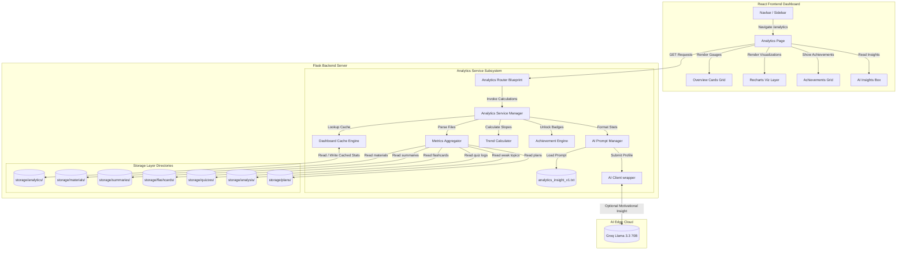

# Software Design Document: Learning Analytics Dashboard (Phase 9)

This document describes the architectural, security, API, service layer, prompt, and UI/UX design specifications for **Phase 9: Learning Analytics Dashboard** of the StudyAI application.

---

## 1. Overall Architecture

The Learning Analytics Dashboard acts as a unified read-only dashboard. It queries statistics from all existing database directories (materials, summaries, flashcards, quizzes, weak topics, plans) and runs calculations locally to format trends, activity logs, and achievements.



---

## 2. Analytics Workflow

1.  **Student Opens Dashboard**: The student navigates to the "/analytics" page.
2.  **Lookup Cache**: The backend queries `/storage/analytics/snapshot.json`.
    *   *If cached snapshot exists and is fresh* (< 5 minutes old): Immediately returns cached metrics.
    *   *If stale or missing*: Triggers metrics aggregation.
3.  **Metrics Aggregation**:
    *   Reads `materials.json` to calculate uploaded document counts.
    *   Scans summaries folder to count version totals.
    *   Reads flashcard JSON files to count mastered cards.
    *   Aggregates quiz attempts to compute scores (Average, Highest, Lowest).
    *   Reads Weak Topic Analysis files to group Critical vs. Strong subjects.
    *   Reads study plans to count tasks completed, remaining, and streak limits.
4.  **Trend & Achievement Evaluations**:
    *   Runs deterministic slope calculations over quiz score history.
    *   Checks badge unlock rules (First Upload, Streak milestone, etc.) to set achievements status.
5.  **LLM Call (Optional)**: If the student requests study tips, the backend passes stats to the AI client using `analytics_insight_v1.txt` to format motivational feedback.
6.  **Visual Presentation**: Renders line charts, rings, calendars, timeline activity feeds, and unlock achievement cards on the frontend.

---

## 3. Dashboard Sections & Layout

*   **Overview KPI Grid**: Uploaded counts, average score, mastered flashcards percentage, and consistency streaks.
*   **Learning Progress (Line Chart)**: Progress timeline showing weekly summary counts, card reviews, and quiz sessions.
*   **Quiz Performance (Bar Chart)**: Quiz score averages grouped by study material.
*   **Flashcard Mastery (Pie Chart)**: Ratio of mastered vs. learning flashcards.
*   **Weak Topics Summary (Diagnostic Table)**: Lists topics classified as Critical/Weak.
*   **Study Planner Progress (Doughnut Chart)**: Tasks completed vs. remaining counts.
*   **Activity Timeline**: Vertical stream of recent events.
*   **Achievements Panel**: Grid of badges showing unlock status.

---

## 4. Metrics Engine Specifications

*   **Learning Consistency Score**:
    $$\text{Consistency} = \left(\frac{\text{Study Days in Past 30 Days}}{30}\right) \times 100$$
*   **Learning Velocity**: Average count of flashcards reviewed + quizzes attempted per week.
*   **Quiz Trends**: Mathematical slope calculated over the latest 10 attempts to determine if accuracy is rising or falling.

---

## 5. REST API Design

All endpoints reside under `/api/v1/analytics`.

### 1. GET `/api/v1/analytics/dashboard`
*   **Purpose**: Fetch the complete aggregated metrics snapshot for the dashboard view.
*   **Successful Response** (`200 OK`):
    ```json
    {
      "overview": {
        "materials_uploaded": 8,
        "summaries_generated": 6,
        "flashcards_generated": 120,
        "flashcards_mastered": 75,
        "quiz_attempts": 22,
        "avg_quiz_score": 82.5,
        "highest_score": 100.0,
        "lowest_score": 45.0,
        "weak_topic_count": 2,
        "strong_topic_count": 8,
        "current_streak": 5,
        "longest_streak": 12,
        "consistency_score": 85.0
      },
      "last_updated": "2026-07-15T20:00:00Z"
    }
    ```

### 2. GET `/api/v1/analytics/performance`
*   **Purpose**: Get detailed performance timelines for rendering Recharts components.

### 3. GET `/api/v1/analytics/activity`
*   **Purpose**: Fetch recent activity logs.

### 4. GET `/api/v1/analytics/trends`
*   **Purpose**: Retrieve calculated slope values for score trends and learning velocity.

### 5. POST `/api/v1/analytics/refresh`
*   **Purpose**: Clear the cached analytics file and force a recalculation across all directories.

---

## 6. Backend Services Design

*   **`AnalyticsService`**: Orchestrates requests, matches cached files, and triggers calculations.
*   **`MetricsAggregator`**: Reads JSON data from storage directories and aggregates scores.
*   **`TrendCalculator`**: Evaluates quiz score slopes, flashcard mastery progress, and study consistency over time.
*   **`AchievementEngine`**: Tracks and unlocks achievements.
*   **`DashboardCache`**: Manages snapshot file caching (`storage/analytics/snapshot.json`).

---

## 7. Achievement Badging System

Achievements are calculated deterministically on every analytics fetch.

### Achievement Schema
```json
{
  "achievement_id": "ach_streak_7",
  "name": "7-Day Study Streak",
  "description": "Maintain a study planner streak for 7 consecutive days.",
  "unlocked": true,
  "unlock_date": "2026-07-14T15:00:00Z",
  "progress_percent": 100.0
}
```

### Badge Unlock Rules
1.  **First Upload**: Unlocked if `materials_uploaded` $\ge 1$.
2.  **First Summary**: Unlocked if `summaries_generated` $\ge 1$.
3.  **Perfect Quiz**: Unlocked if `highest_score` $== 100.0$.
4.  **Planner Completed**: Unlocked if overall study plan completion $\ge 100\%$.

---

## 8. Frontend Architecture & React Visualizations

### Chart Library: Recharts
**Why Recharts?**
1.  **React-Native Compatibility**: Uses declarative JSX wrappers (`<LineChart />`, `<Bar />`) that align with Vite layouts.
2.  **Lightweight Build Size**: Fits within Vite chunk limits.
3.  **Aesthetics**: Supports gradients, hover animations, and dark mode out-of-the-box.

---

## 9. AI Study Insights Prompt (`analytics_insight_v1.txt`)

### Prompt Specification (`backend/services/ai/prompts/analytics_insight_v1.txt`)
```
You are an expert academic mentor. Your task is to analyze the student's study performance metrics and generate motivational advice and practical revision suggestions.

Adhere to the following JSON output format:
{
  "insight_paragraph": "A detailed paragraph containing motivational study insights.",
  "suggested_actions": [
    "Suggested action item 1",
    "Suggested action item 2"
  ]
}

Constraints:
1. Do NOT calculate any statistics. Focus only on translating the provided data profile into encouraging feedback.
2. If weak topics exist, focus suggestions on revision methods for those topics.
3. Output MUST be valid, raw JSON. Do NOT include markdown code blocks (e.g. ```json). Output ONLY the JSON string.

[START OF PERFORMANCE PROFILE]
Total Uploads: {{ uploads }}
Mastered Flashcards: {{ fc_mastered }}/{{ fc_total }}
Quiz Averages: {{ quiz_avg }}%
Streak Count: {{ streak }} days
Weak Topics Detected:
{{ weak_topics_str }}
[END OF PERFORMANCE PROFILE]
```

---

## 10. Security & Performance Controls

*   **Read-Only Aggregations**: The metrics engine only reads files; it does not write to or alter summaries, quizzes, or flashcards databases.
*   **Cached Snapshot Protection**: Snapshot reads are wrapped in error handlers to prevent corrupted caches from blocking dashboard rendering.
*   **Lazy Chart Rendering**: React charts are loaded lazily to improve page load speed.

---

## 11. Testing Strategy

### Pytest Cases
*   `test_aggregation_empty_databases`: Verifies that zeroed metrics are returned when database folders are empty.
*   `test_trends_slope_calculations`: Validates the mathematical slope calculations for score trends.
*   `test_achievement_unlock_logic`: Asserts that achievements unlock correctly when milestones are reached.
*   `test_insights_variable_injection`: Tests variable interpolation inside the insight prompt.

---

## 12. Folder Structure Map

### New Folders
*   `backend/storage/analytics/`

### New Files
*   `backend/services/ai/prompts/analytics_insight_v1.txt`
*   `backend/services/analytics_service.py`
*   `backend/routes/analytics.py`
*   `backend/tests/test_analytics.py`
*   `frontend/src/pages/AnalyticsDashboard.jsx`

### Modified Files
*   `backend/routes/__init__.py`
*   `frontend/src/constants/index.js`
*   `frontend/src/App.jsx` (mounts the new dashboard route element)

---

## 13. Git Workflow

Commit iteratively during Phase 9:

*   `feat(backend): create analytics snapshot storage directory and routes`
*   `feat(backend): implement metrics aggregator service for local read-only files`
*   `feat(backend): build trends math calculations and badge unlock rules`
*   `feat(frontend): install Recharts dependencies and build dashboard analytics view`
*   `feat(frontend): build achievements list panels and recent activities timeline`
*   `test: create pytest unit tests verifying score trend slopes and empty states`

---

## 14. Acceptance Criteria

1.  **Read-only Metric Aggregations Complete**: Metrics are calculated entirely from existing databases without generating new AI content.
2.  **Recharts Render Correctly**: Progress charts, pie graphs, and performance bars scale responsively across mobile, tablet, and desktop views.
3.  **Achievement System Operates**: Badges unlock based on deterministic milestones.
4.  **Caching Snapshots Sync**: Forced refreshes clear the cache and recalculate metrics immediately.
5.  **Vite Build Completes**: Compiles cleanly with no dependency errors.
